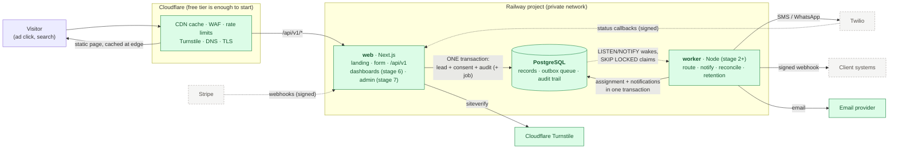
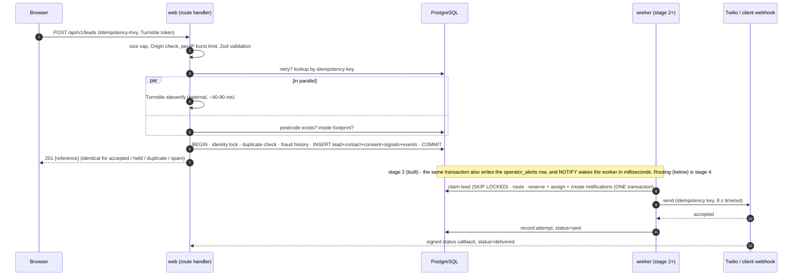

# Architecture

**Recommendation in one paragraph.** A *modular monolith*: one repository, one Next.js web process (landing page, API, later the
dashboards) and one Node worker process (stage 2+), sharing framework-free domain modules and a single PostgreSQL database that is
the system of record, the job queue (transactional outbox) and the audit trail. Cloudflare sits in front for CDN, WAF, rate limiting
and bot challenge. Everything that must be atomic (lead + consent + audit; assignment + notification intent; credit + charge) happens
in one database transaction; everything slow or external (SMS, webhooks, email) happens after commit, driven by rows in the
database, so a provider outage can delay a notification but never lose a lead.

## System diagram



Green = exists (stages 1 and 2: `web` serves the landing page, the API and the operator inbox; `worker` sends operator alert emails and reconciles; the email provider is the Resend adapter, tested only against a local fake). Dashed = designed, built in later stages.
In stage 2 the worker does not route or assign: it sends the operator's alerts. Routing and client notifications arrive in stages 4-5.

## One lead, end to end



## The ten Phase-0 questions

**1. Recommended architecture.** The modular monolith above. Reliability > simplicity > security > speed > scalability > cleverness.

**2. Synchronous vs asynchronous.**

| Step | Mode | Why |
| --- | --- | --- |
| Validate payload, origin, burst limit | sync, in request | Cheap; rejects abuse before it touches the database |
| Turnstile verification | sync, in request (parallel with DB reads) | Must gate creation; fails open with a penalty |
| Postcode + footprint check | sync | The visitor needs the answer; ~1 ms indexed lookup |
| Duplicate + fraud-history checks, insert | sync, **one transaction** | Must be atomic and serialised per person |
| Respond to the consumer | sync, right after COMMIT | The only thing the consumer waits for |
| Routing, assignment, pricing, credit check | **async** (stage 2+), worker, ~100 ms after commit | Decoupled so ingestion stays trivially simple and fast; failure is retried from database state |
| Notifications (SMS, WhatsApp, email, webhook) | **async**, outbox rows | External, slow, can fail; must never block or lose a lead |
| Delivery status, disputes, billing, retention, reconciliation | async / scheduled | Not on the consumer's path |

**3. Redis or message queues?** Not now (decision D1). The queue is PostgreSQL: a `notifications` outbox (the row *is* the queue
item and the audit record) woken by `LISTEN/NOTIFY` and claimed with `FOR UPDATE SKIP LOCKED`, plus `graphile-worker` for generic
scheduled jobs (retention, reconciliation, reports). The dual-write problem is eliminated rather than patched. **As built in stage 2 (decision D14):** the outbox
table is `operator_alerts`, claimed with `SKIP LOCKED` under a lease, and the reconciler is a plain idempotent tick, so `graphile-worker` was not adopted yet. All queue SQL lives in one file
(`src/modules/alerts/repo.ts`), so swapping in BullMQ or SQS later is a contained change.

**4. Monolith or modular monolith?** Modular monolith, with boundaries enforced by ESLint (see "Project structure"): domain code
cannot import the web layer, UI cannot import the database.

**5. What to separate only when scale demands it.** (a) The worker is already a separate *process* from stage 2 (different failure
and scaling profile, same code). (b) Notification delivery as its own service, only if provider throughput or a team boundary demands
it. (c) Analytics/reporting onto a read replica, then a warehouse, only when reports slow the primary. (d) The client dashboard as its
own deployable only if its release cadence diverges. Not before.

**6. Where caching is used.**

| Cache | Where | TTL / invalidation | Why |
| --- | --- | --- | --- |
| Landing page + static assets | Cloudflare edge | Rebuild/redeploy; `s-maxage` header | The only traffic spike is ads; the page is static HTML |
| Reference data (vertical, service-type and source ids) | In-process, per web instance | 60 s | Three tiny lookups per request avoided; admin changes apply within a minute |
| Postcode directory | **None** | n/a | Primary-key lookup, sub-millisecond; a cache would add invalidation for nothing |
| Routing eligibility, client config | None initially; short in-process TTL if measured necessary | n/a | Hundreds of rows; measure first |
| Redis | None | n/a | See Q3 |

**7. Where rate limiting happens (defence in depth).**

| Layer | What | Notes |
| --- | --- | --- |
| Cloudflare edge | Per-IP request rate on `/api/*` (free tier: one rule), WAF managed rules, bot score | First and cheapest line; absorbs floods before they reach us |
| App, in memory (`src/lib/rate-limit.ts`) | Per-IP sliding window: 8 submissions / 10 min, 60 coverage checks / min | Burst control only; per instance, resets on deploy (documented limitation). Skipped when the client address is unknown, so one abuser cannot lock everyone out |
| Database-backed signals | IP velocity, phone/email reuse, duplicates (in the fraud score) | Shared across instances; feeds scoring, not hard blocks |
| Outbound | Per-provider concurrency in the worker (stage 5) | Protects Twilio/webhook receivers |

**8. Low latency without extra infrastructure.** One round trip budget, measured (06-operations.md): the consumer-facing request
costs **~40 ms end to end** locally, of which ~38 ms is the Cloudflare verification call; our own validation + transaction is **2.6 ms
p50 / 2.9 ms p95** and sustains ~1,200 leads/s. Techniques: parallelise the external call with database reads, keep the transaction
to indexed point operations, cache only slow-changing reference data, serve the page statically, send no unneeded JavaScript, and
do nothing else in the request that can be done after commit. No new infrastructure was needed for any of these.

**9. Server vs client.**

| Concern | Client (browser) | Server (authoritative) |
| --- | --- | --- |
| Step navigation, tile UX, progress, focus | yes | no |
| Format validation (postcode, phone, email, name) | instant feedback, **same Zod schemas** | re-validated; the only trusted result |
| Coverage ("do we serve this postcode?") | shows the server's answer | decides |
| Duplicate detection, fraud scoring, consent versioning | no | yes |
| Idempotency key | generates it (UUID) | enforces uniqueness in the database |
| Attribution | reads URL parameters | sanitises, classifies the channel |
| Form progress | `sessionStorage` (never consent) | none |
| Retries | bounded retries with the same key | idempotent, so a retry cannot duplicate |

No business rule exists in both places: shared code (`src/modules/*/schemas`, `src/modules/postcodes/normalise.ts`) is imported by both.

**10. Evolution: 100, then 10,000, then 100,000+ leads a month.** Context: 100,000 leads a month is ~140 an hour, ~2.3 a minute on
average, perhaps 20 a minute at an ad peak. Our code path alone sustains ~1,200 per *second*. The challenges at scale are
operational and commercial (providers, compliance, on-call, ad accounts), not database throughput.

| Scale | Shape | What changes | Signal to move |
| --- | --- | --- | --- |
| **~100-1,000 / month** | 1 web + 1 worker + small Postgres + Cloudflare free. Nightly off-site dumps. Sentry free, uptime check. | Nothing else. A canary lead every 5 min once routing exists. | n/a |
| **~10,000 / month** | 2 web replicas, 2 workers (`SKIP LOCKED` makes extra workers safe), managed Postgres with PITR, pgBouncer for web only (workers connect directly for `LISTEN`). Partition `lead_events`/`audit_logs` by month. | Cloudflare Pro; SLO alerting; WhatsApp added; read-only reporting role | Backups matter commercially; a client contract demands an SLA |
| **~100,000+ / month** | Same shape, bigger: HA Postgres (RDS Multi-AZ or equivalent), 3-4 web, 2-4 workers, read replica for analytics, SMS cost optimisation (WhatsApp/push). Container platform may move to AWS/ECS. | Queue to SQS/BullMQ **only if** a trigger from D1 fires; analytics warehouse; automated retention and DSAR tooling; formal on-call | Dashboard queries slow the primary; provider rate limits; compliance audit |

## Project structure

Adapted to the Next.js 16 App Router (as built):

```
src/
  app/                    Next.js routes ONLY. Pages are server components; route.ts files are 5-line controllers.
    api/health, ready     liveness / readiness
    api/v1/leads          POST: ingest a lead
    api/v1/postcodes/check POST: coverage check
    api/pipeline          alerting-pipeline health for an uptime monitor (worker alive, no overdue/dead alert)
    admin/                the operator inbox (stage 2): pages + server actions, reachable only through src/server/admin
    privacy, terms        legal pages (draft banner until LEGAL_TEXT_REVIEWED)
  components/             UI. landing/ (static sections), lead-form/ (client component: state machine, steps, API client), ui/ (controls)
  proxy.ts                first gate for /admin: valid Cloudflare Access token + allowlisted email, else 403
  modules/                DOMAIN, framework-free. Each module = schemas + service + repo (+ index.ts as its public surface)
    leads/                schemas (shared with browser), service (the use case), repo (all SQL)
    alerts/               operator alert outbox: repo (all queue SQL), service (claim/send/retry/reconcile), message, backoff, ports
    inbox/                what an operator sees and does: read models, approve/reject held leads, mark handled, operators
    fraud/                score, signals, history (DB velocity), challenge (Turnstile)
    postcodes/            normalise (shared), service, repo, onspd (importer parsing)
    consent/ attribution/ reference/
  server/                 Composition root (container.ts: the ONE place implementations are chosen) + HTTP handlers + db accessor
    admin/                the data-access layer for the inbox: authenticates (requireOperator) and validates on every call
  lib/                    Foundations: env (validated), db client, http helpers, logging, ip trust, rate limiter, ids, hashing, errors
  config/                 Decisions as code: brand, electrical vertical, consent wording, fraud weights, retention periods
  workers/                the worker process (stage 2): main.ts entrypoint, the control loop, the LISTEN connection
  integrations/           adapters behind interfaces: email/ (Resend, console) in stage 2; twilio and stripe later
db/migrations/            SQL, roll-forward only        db/seeds/   idempotent reference data
scripts/                  migrate, seed, types, ONSPD import, local Postgres
tests/                    integration (real Postgres) and e2e (Playwright); unit/component tests sit beside the code
docs/                     this documentation; docs/design/target-schema.sql is the executable design for stages 2-10
```

**Dependency rules (enforced by `npm run lint`):** `modules` must not import `app`, `components`, `server` or `next/*`; `lib` and
`config` must not import the web layer; `components` and `app` must not import `server`, `lib/db`, repositories, `pg`, `kysely` or Node
built-ins. Controllers translate HTTP to a service call and back; services own the use case and the transaction boundary; repositories
own SQL; nothing else touches the database.

The one exception to "UI must not import `src/server`": pages under `src/app/admin` may import the data-access layer, `@/server/admin/{inbox,clients,pricing,assignments}`, and nothing else from `src/server` (lint refuses `session`, `authorizer`, the container and the database). A source-level test
(`src/server/admin/admin-guard.test.ts`) also fails if an admin page or action does not authenticate through it.

**Known gap:** nothing yet stops one module importing another module's `repo.ts`. Modules should call each other only via
`index.ts`; add an ESLint rule when the second consumer appears. (Stage 3 added six modules that call each other, `clients`, `coverage`, `pricing`, `assignments`, `privacy` and `audit`; they do so through `index.ts` by convention and review only, so **the rule is now overdue**: do it first in stage 4.)
