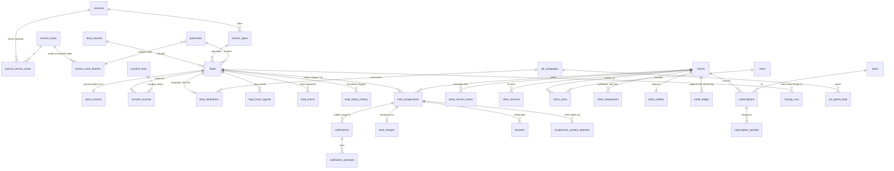
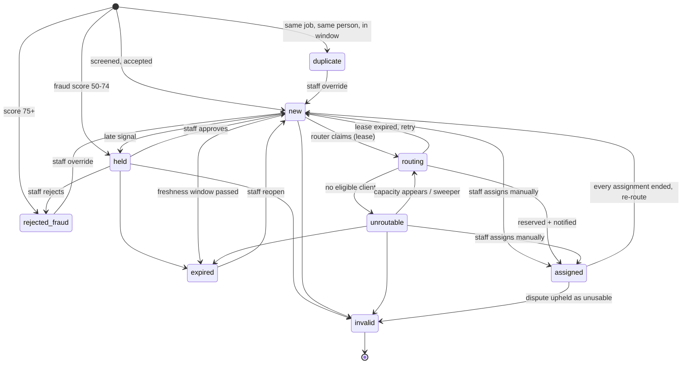

# Data model

PostgreSQL is the only datastore. Built today: `db/migrations/0001_lead_capture.sql` (16 tables, stage 1), `0002_operator_alerts.sql` (4 tables, stage 2), `0003_clients_and_assignments.sql` (9 tables, stage 3), `0004_suppression_last_requested.sql` and `0005_routing.sql` (5 tables, stage 4) and `0006_delivery.sql` (3 tables, stage 5). Designed and proven by tests:
[`design/target-schema.sql`](design/target-schema.sql) (what is left: the tables and columns for stages 6-10), applied on top of the migrations in
`tests/integration/target-schema.test.ts`, which also runs the race conditions described below. Migrations are roll-forward only and never edited once applied.

## Principles

1. **The database enforces what must never be false.** Application code validates for friendliness; constraints, partial unique
   indexes, exclusion constraints, triggers and the least-privilege role guarantee correctness when code is wrong or racing.
2. **Ids.** `uuid` (v4, `gen_random_uuid()`) for anything a client, consumer or URL can reference (non-enumerable, IDOR-resistant).
   `bigint identity` for high-volume append-only logs (ordered, compact). Small reference tables use `integer identity` + a unique
   `slug`; code resolves slugs, never hard-codes ids. The human `reference` (`L-7K3M9-P2Q4T`) is for conversations, never authorisation.
3. **Money** is integer pence. Never floats. VAT is applied at invoice time, not stored in prices.
4. **Enums** are native Postgres enums for closed, code-aware sets (a test asserts they match the TypeScript constants). Adding a
   value is `ALTER TYPE ... ADD VALUE`; removing one is a migration project, so values are added deliberately.
5. **Personal data is isolated.** `lead_contacts` holds name/phone/email/notes/IP/user-agent; consent evidence holds IP/user-agent.
   Nothing else may. Erasure = blank one row (constrained by CHECKs so a half-erased row is impossible) plus `leads.postcode`.
6. **Audit by construction.** Lifecycle changes write history from a trigger (the app role cannot forge or skip it); evidence tables
   are append-only (a trigger forbids UPDATE/DELETE even for the owner); timestamps and actor/request ids tie rows to requests.
7. **Soft deletion** only where an operator can legitimately hide a row (`leads.deleted_at`, `clients.deleted_at`,
   `users.deleted_at`). Evidence is never deleted; personal data is anonymised in place.
8. **Cascades are deliberate.** Child tables that are pure personal data/metadata of a lead cascade (`lead_contacts`,
   `lead_attributions`); audit and consent tables are `RESTRICT`, so a stray `DELETE FROM leads` fails instead of destroying evidence.

## Entity map



Built today: everything touching `verticals`, `service_*`, `postcodes`, `leads`, `lead_*`, `consent_*`, `lead_sources`, and (stage 3) `clients`, `client_services`, `client_service_areas`, `pricing_rules`, `lead_assignments` and its history, `suppressions`, `audit_logs`. and (stage 4) `routing_settings`, `routing_rules`, `routing_runs`, `client_working_hours`, `client_pauses`, and (stage 5) `notifications`, `notification_attempts`, `provider_events`. Everything else from
`users` onward is the target schema (stages 6-9).

### What migration 0006 contains (stage 5)

| Table / object | Purpose | Notable guarantees |
| --- | --- | --- |
| `clients.delivery_mode / delivery_enabled_at / notify_email / notify_sms / notify_webhook / webhook_url / webhook_secret_enc / webhook_secret_hint / webhook_failing_since` | How a business wants to be told: `manual` (default) or `automatic`, and on which channels | CHECKs: automatic needs a channel and a start time; SMS needs a phone number; a webhook needs an `https://` address AND a stored secret; the secret is **encrypted** (AES-256-GCM), only its last four characters are readable |
| `notifications` | The delivery outbox: one row per (assignment, channel), the work item AND the audit record | Written by a **trigger** in the assignment's own transaction; `UNIQUE (assignment_id, channel)`; lease, attempts and `sent` CHECKs as for `operator_alerts`; **holds no personal data** (the message is built at send time) |
| `notification_attempts` | One append-only row per finished attempt (outcome, error code, HTTP status, latency); a lost attempt is recorded as `abandoned` | Append-only trigger; `UNIQUE (notification_id, attempt_no)` so a zombie worker cannot record a second result |
| `provider_events` | Twilio's delivery reports, each applied once | `UNIQUE (provider, event_id)`; status and error code only (the report's phone numbers are not kept); `processed_at` NULL until applied (a report can beat our own bookkeeping) |
| triggers `enqueue_assignment_notifications`, `cancel_assignment_notifications`, `notify_notifications_due` | Create notifications for a business on automatic delivery; cancel those not yet sent when the assignment ends; wake the worker (`notifications_due`) | Cover every way an assignment is made or ended; NOTIFY is delivered at COMMIT |

Deliberately not in 0006: a canary table, per-channel fallback ordering, WhatsApp, client API keys and several webhooks per client (`client_integrations`, stage 8).

### What migration 0005 contains (stage 4)

| Table / object | Purpose | Notable guarantees |
| --- | --- | --- |
| `clients.timezone / priority / weight / daily_lead_cap / monthly_lead_cap` | What a business asked for: its own clock, its place in line, its share (0 = manual only), its limits | CHECK ranges; the timezone must be a real IANA name (`is_valid_timezone`); the application role can update but never delete a client |
| `client_working_hours` | One or more windows per weekday in the business's time zone; no rows = no restriction | `closes > opens`; weekday 0-6; unique per (client, weekday, opens) |
| `client_pauses` | A holiday or a full diary: no automatic leads while any pause covers the moment | `ends_at > starts_at`. **No exclusion constraint on overlaps** (needs `btree_gist`; overlapping pauses are harmless) |
| `routing_settings` | Per vertical: `enabled` (default **false**), `enabled_at`, `max_lead_age_hours`, `poked_at` | `enabled` requires `enabled_at`; `poked_at` is bumped by a statement trigger when anything routing depends on changes |
| `routing_rules` | The filters, limiters and rankers: type, kind, position, parameters, on/off, version | One of each type per vertical; type and kind must pair up (CHECK); positions unique per kind (deferrable, so two rankers can swap); the application role can update but not insert or delete |
| `routing_runs` | Every routing attempt: the rules in force (snapshot), a verdict for every candidate, the price, the duration | **Append-only** (trigger, even for the owner); `assigned` if and only if a business was chosen (CHECK) |
| `lead_assignments.routing_run_id` | Links an automatic assignment to the run that explains it | CHECK: `assigned_by = 'router'` requires a run and no operator; a manual one still requires an operator (0003) |
| `leads.routing_attempted_at`, index `leads_routable_idx`, transition `new -> unroutable` | When the router last looked, a tiny partial index for its work queue, and the move for "nobody could take it" | |
| triggers `notify_routing_due`, `routing_poke` | Wake the router when a lead becomes `new`, or when a client, coverage rule, hours, pause, price or routing rule changes | NOTIFY is delivered at COMMIT; `routing_poke` touches one settings row and **never a lead row** (a lead lock inside a client edit could deadlock the router) |

Deliberately **not** in 0005: `clients.max_open_leads` (stage 6: "unanswered" cannot be measured until clients can accept or reject) and the `routing` lead status as a lease (never used: decision D27).

### What migrations 0003 and 0004 contain (stage 3)

| Table / object | Purpose | Notable guarantees |
| --- | --- | --- |
| `clients` | The businesses that buy leads | Lower-case contact email and E.164 phone CHECKs; at least one of exclusive/shared accepted; the application role can insert and update but never delete (a client ends as `churned`) |
| `client_services`, `client_service_areas` | What a client does, and its coverage rules (`outward`, `sector`, `postcode_prefix`, `area`, `radius`; `include` / `exclude`) | A rule populates exactly the fields of its kind (CHECK); partial indexes per kind so the eligibility query uses each |
| `pricing_rules` | Flat price per lead by service, area, urgency, lead type, with `valid_from` / `valid_to` | Immutable: a trigger allows only ending a rule (never un-ending, extending or deleting); one advisory lock per scope serialises concurrent changes, so two rules never overlap |
| `lead_assignments` | Who holds which lead, at what price, assigned by whom | **The double-sale guard**: partial unique indexes (one active exclusive holder per lead; never the same client twice); a composite foreign key commits a lead to one sale model; a trigger keeps `leads.assignments_count` equal to the active assignments and a CHECK stops it exceeding `max_assignments`; the cap can never exceed what the consent text promised; no assignment for a lead whose consent was withdrawn, was erased, or whose consent allows no business; a lead marked `assigned` must have an active assignment (deferred to commit, so either order inside one transaction works); ending an assignment needs a named actor and a reason |
| `assignment_status_transitions`, `lead_assignment_status_history` | Legal transitions; automatic history with actor and reason | Trigger-written (SECURITY DEFINER), append-only; the application role cannot write or delete it |
| `suppressions` | People we must not contact again | **Keyed HMAC-SHA-256** of the normalised email or phone (`PRIVACY_HASH_KEY`), never the plain value; unique per (kind, value); insert-only for the application role except refreshing `last_requested_at` (0004: the latest request to stop counts) |
| `audit_logs` | Every staff change: actor, action, entity, reason, before/after | Append-only (trigger, even for the owner); a deny-list in `writeAudit` refuses consumer fields; ids and codes only |
| `leads.sale_model`, `max_assignments`, `assignments_count` | A lead commits to a sale model and a recipient cap | See "Exclusivity enforced by the database" below |

Deliberately **not** in 0003 (stage 4 adds them when routing needs them): client priority, weight, caps and timezone; working hours; pauses; `routing_rules`, `routing_runs` and `lead_assignments.routing_run_id`.

### What migration 0002 contains (stage 2)

| Table / object | Purpose | Notable guarantees |
| --- | --- | --- |
| `operator_alerts` | The alert outbox: one row per (lead, kind: `new_lead`, `held_lead`, `reminder`); the work item **and** its audit record | `UNIQUE (lead_id, kind)` makes creation idempotent; CHECKs tie `sent` to `sent_at` and `sending` to a lease; attempts bounded by `max_attempts`; the app role cannot delete; no personal data |
| `operator_alert_attempts` | One append-only row per finished attempt (outcome, error code, latency); a lost attempt is recorded as `abandoned` | Append-only trigger; `UNIQUE (alert_id, attempt_no)` so a zombie worker cannot record a second result |
| `operators` | The people behind Cloudflare Access, so staff actions have a stable actor id; stage 3 adds the role (`owner` / `staff`, from `ADMIN_OWNER_EMAILS`) | Lower-case email CHECK. Stays the staff table (decision D19); `users` is for client logins, stage 6 |
| `worker_heartbeats` | Proves a worker is alive; read by `/api/pipeline` | Not evidence: pruned after a day |
| trigger `leads_enforce_held_review_actor` | `held -> new` and `held -> rejected_fraud` need a staff actor **and** a reason in the transaction context | Automated exits from `held` (expiry) are unaffected |
| `lead_events` types `lead.handled`, `lead.review_approved`, `lead.review_rejected` | The operator's actions, with the staff `actor_id` | Payload = a reason code only |

### What migration 0001 contains

| Table | Purpose | Notable guarantees |
| --- | --- | --- |
| `verticals`, `service_types`, `lead_sources` | Reference data (niche, services, acquisition channels) | `slug` format CHECK; `active` flags (seeds never re-activate what an operator disabled) |
| `service_areas`, `service_area_districts`, `vertical_service_areas` | Named geographies; the footprint a vertical accepts | Outward-code format CHECK |
| `postcodes` | ONS Postcode Directory | Canonical-format CHECK; **generated** `outward`, `sector`, `area`; coordinates both-or-neither; never deleted |
| `leads` | The enquiry (non-personal columns) | `reference` and `idempotency_key` unique; duplicate link consistent with status; transition trigger; history trigger; deferred "must have consent and contact" trigger |
| `lead_contacts` | **All** personal data | E.164 / lower-case-email CHECKs; erasure CHECKs; partial indexes for duplicate and velocity lookups |
| `consent_texts` | Immutable, versioned wording | Trigger blocks edits to published wording and deletion; recipient model and max recipients consistent |
| `consent_records` | Append-only grant/withdrawal evidence | Append-only trigger; `RESTRICT` to lead |
| `lead_attributions` | UTM, click ids, landing path, referrer host | Length-bounded; path only (no query strings) |
| `lead_fraud_signals`, `lead_events` | Why a lead scored what it did; business event log | Append-only; JSON object CHECKs; no personal data (tested) |
| `lead_status_transitions`, `lead_status_history` | Legal transitions; automatic history | Trigger-written (SECURITY DEFINER), app role cannot write it directly |

## Postcodes and geographic matching

**Source of truth: the ONS Postcode Directory** (OGL), loaded by `npm run postcodes:import` into `postcodes` (~1.7M live rows for
the UK; the whole table is a few hundred MB with indexes). Refresh quarterly; rows are upserted and never deleted, so a lead's
postcode foreign key stays valid after a postcode is terminated.

**Lookup path at submission** (`src/modules/postcodes`):

1. `normalisePostcode` (shared with the browser): strip, upper-case, split the last three characters as the inward code, validate
   both halves structurally. `"br60aa"` -> `"BR6 0AA"`.
2. Footprint check by **outward code**: `vertical_service_areas -> service_areas -> service_area_districts` (a primary-key-sized join).
   Decided *first*, so a visitor outside the area is told so even if they mistyped the postcode: the more useful answer.
3. Existence check: primary-key lookup in `postcodes`. Both run in parallel; each is sub-millisecond.
4. The lead stores the full `postcode` (personal data, nullable after erasure) and `postcode_outward` (kept for analytics).

**Matching a lead to clients (stage 4).** Clients declare coverage as rules in `client_service_areas`: `outward` (BR6), `sector`
(BR6 0), `postcode_prefix`, named `area`, or `radius` from a centre postcode, each `include` or `exclude`. A client is eligible when
any active include matches and no exclude does. The tested query is `findEligibleClients` in `src/modules/coverage/repo.ts` (built in stage 3); it is one `UNION ALL` branch per
rule kind so each uses its own partial index, and it evaluates the haversine distance only for radius rules, because the *clients* are
the small set, not the postcodes.

**Why not PostGIS (yet).** District/sector matching needs no geometry. A radius test over a handful of rules costs microseconds
without an index. PostGIS pays off for drawn polygons (a whole local-authority boundary), drive-time approximations, or radius search over
>100k rules; none apply in stages 1-8, and PostGIS complicates local development, CI containers and some managed-database choices.
*Adopt PostGIS when:* a client needs boundary-polygon coverage or an admin wants a coverage map; then add `geom geography(Point)` to
`postcodes` and a `polygon` rule kind in one migration. (PostGIS is available in the Homebrew build used for development, so the
migration is testable.)

## Lifecycles

The brief proposes one list: `submitted -> validating -> validated -> routing -> assigned -> delivered -> accepted`, plus `duplicate`,
`fraud_rejected`, `invalid`, `routing_failed`, `delivery_failed`, `disputed`, `refunded`, `expired`. Mixing them breaks as soon as a
lead has more than one buyer, so they live in three machines. **Mapping:**

| Your state | Where it lives now |
| --- | --- |
| submitted, validating | Not stored: validation happens before the insert (an invalid submission is a 422, not a row) |
| validated | `leads.status = new` |
| duplicate, fraud_rejected (`rejected_fraud`), invalid, expired | `leads.status` |
| routing, assigned, routing_failed (`unroutable`) | `leads.status` |
| delivered | `notifications.status = delivered` (per channel); `lead_assignments.status = notified` once a channel is confirmed |
| delivery_failed | `lead_assignments.status = delivery_failed` after all channels are exhausted |
| accepted, disputed, refunded | `lead_assignments.status` |

### Lead (built)



| Transition | Caused by | Who |
| --- | --- | --- |
| create -> `new` / `held` / `duplicate` / `rejected_fraud` | Screening result inside the ingest transaction (reject wins over duplicate wins over review) | consumer request |
| `held` -> `new` / `rejected_fraud` / `invalid` | A human reviews the fraud queue | staff |
| `new` -> `routing` | Router claims it with a lease (`SELECT ... FOR UPDATE SKIP LOCKED`) | worker |
| `routing` -> `assigned` / `unroutable` / `new` | Reservation committed / no candidates / lease expired | worker |
| `unroutable` -> `routing` | New client or credit becomes eligible; periodic sweeper | worker |
| `new`/`unroutable` -> `expired` | Lead older than the vertical's freshness window with no buyer | sweeper |
| `assigned` -> `new` | Every assignment ended (rejected/refunded/failed) and the lead is still sellable | worker/staff |
| overrides (`duplicate`/`rejected_fraud`/`expired` -> `new`) | A person corrects an automated decision; reason mandatory | staff |

**Legality is data, not code:** `lead_status_transitions` lists the allowed pairs; a `BEFORE UPDATE OF status` trigger rejects
anything else (SQLSTATE `23514`), and an `AFTER` trigger writes `lead_status_history` including actor, reason and request id from
transaction-local settings (`app.actor_type`, `app.request_id`, ...). Neither can be skipped by a code path, only by a superuser.

**Idempotent transitions** use compare-and-set, never read-then-write:

```sql
UPDATE leads SET status = 'routing' WHERE id = $1 AND status = 'new' RETURNING id;   -- 0 rows => someone else already moved it: do nothing
```

Retried jobs, double-clicked admin buttons and racing workers all converge on the same state, and the history shows one transition.

### Assignment (stage 4, designed and tested)

`reserved -> notified -> accepted -> disputed -> refunded`, plus ended states `rejected`, `expired`, `cancelled`, `delivery_failed`.
Active = `reserved | notified | accepted | disputed`. Ended states are terminal: ending an assignment *frees the lead*, it never reopens
the assignment (a new one is created). Legality and history use the same trigger pattern (`assignment_status_transitions`).

### Operator alert (stage 2, built)

`pending -> sending -> sent`, with `retrying` (retryable failure, or a lease the reconciler reclaimed), `dead` (a permanent error or retries exhausted: reported by `/api/pipeline` until the lead is handled) and `cancelled`
(a reminder that is no longer needed). Every completion is a compare-and-set on `(status = 'sending', attempt_count)`. See "Stage 2 as built" in 03-routing-and-delivery.md.

### Notification (stage 5)

`pending -> sending -> sent -> delivered`, with `retrying` (after a retryable failure), `failed` (permanent), `dead` (retries exhausted:
needs a human), `cancelled`. See 03-routing-and-delivery.md.

## Exclusivity enforced by the database

Requirement: a lead must never be sold to two businesses unless sharing is explicitly intended, under any concurrency, even if the
application is buggy. Four mechanisms, each proven in `tests/integration/target-schema.test.ts` (against the real tables since stage 3) and, for the manual path, in `tests/integration/stage3-schema.test.ts` and `assignments.test.ts`:

1. **Sale model is committed per lead.** `leads.sale_model` is NULL until the first assignment; `lead_assignments (lead_id, sale_type)`
   has a **composite foreign key** to `leads (id, sale_model)` with `ON UPDATE RESTRICT`. An assignment's type must equal the lead's
   committed model; a shared assignment cannot attach to an exclusive lead; and the model cannot change once assignments exist.
2. **At most one active exclusive assignment**, as a partial unique index:
   `UNIQUE (lead_id) WHERE sale_type = 'exclusive' AND status IN ('reserved','notified','accepted','disputed')`.
   When 12 routers race, 11 get `23505`. This is the double-sale guard; no lock or application check is needed for correctness.
3. **Never the same client twice:** `UNIQUE (lead_id, client_id) WHERE status IN (active...)`.
4. **Shared leads are capped by consent.** `leads.max_assignments` (never above `consent_texts.max_recipients`, enforced by the router
   and a CHECK for exclusive) and `leads.assignments_count`, kept equal to the number of active assignments by a trigger. A CHECK
   `assignments_count <= max_assignments` fails any over-share. The trigger must **lock the lead row first**
   (`SELECT ... FOR NO KEY UPDATE`) and count in a *separate* statement, so the count sees the previous winner's committed row. With
   `FOR UPDATE` instead, the foreign-key check's key-share lock and the trigger's lock deadlock; with no lock, the cap is exceeded.
   Both failure modes were reproduced by deliberately removing the lock and the index; the tests fail without them.

`leads_exclusive_means_one_chk` also forbids an exclusive lead from carrying a recipient cap above one.

**Expect two error classes under races.** Unique-index conflicts surface as `23505`; racing *exclusion* constraints (one live
subscription per client) surface as `23P01` or, when the two inserts see each other, `40P01` (deadlock victim). Any code that
writes these tables must treat `40P01` and `40001` as retryable.

## Attribution and ROAS

**Capture (built).** The browser reads `utm_*`, `gclid`, `fbclid`, `msclkid` from the landing URL at submission time, plus the landing
path and the *host* of the referrer, with no cookie or storage (the parameters stay in the address bar). The server sanitises
(truncates, strips control characters, path only) and **never rejects a lead over attribution**. `classifySource` chooses the channel:
`gclid`/`msclkid` prove paid traffic (only auto-tagging adds them); `fbclid` does **not** (Facebook appends it to every outbound click,
organic posts included), so Meta paid traffic is identified by *our* UTM tagging of the ad URL.

**URL templates to configure in the ad platforms**

```text
Google Ads final URL suffix:  utm_source=google&utm_medium=cpc&utm_campaign={campaignid}&utm_content={adgroupid}&utm_term={keyword}
Meta ad URL parameters:       utm_source=facebook&utm_medium=paid_social&utm_campaign={{campaign.id}}&utm_content={{ad.id}}&utm_term={{adset.id}}
Microsoft Ads:                utm_source=bing&utm_medium=cpc&utm_campaign={CampaignId}&utm_content={AdGroupId}&utm_term={keyword}
```

Using the platform's numeric campaign id as `utm_campaign` makes the join exact: `ad_campaigns.external_id = lead_attributions.utm_campaign`.

**Model (designed).** `ad_campaigns` (platform + external id), `ad_spend_daily` (imported from the platform APIs, primary key
`(campaign_id, spend_date)` so re-imports overwrite), `ad_clicks` (click-level `gclid` -> keyword import from Google Ads `click_view`,
so keyword attribution needs no visitor tracking of our own), and `lead_attributions.campaign_id` resolved by a matching job.

**Metrics** (`v_campaign_funnel_daily`, tested): `Spend -> Leads -> Valid leads (not duplicate/rejected/invalid) -> Sold leads (>= 1 active
assignment) -> Revenue (posted lead_charges)`, from which:

| Metric | Definition |
| --- | --- |
| Cost per lead / valid lead / sold lead | `spend / leads`, `/ valid_leads`, `/ sold_leads` |
| ROAS | `revenue / spend` (gross margin = revenue - spend - messaging/payment costs) |
| Cost per acquired customer | Two meanings, track both: **cost per won job** = spend / assignments whose client-reported outcome is `won` (`assignment_contact_attempts`), and **client acquisition cost** = sales and marketing spend aimed at signing new *client businesses* / new paying clients |
| Client ROI | `sum(job_value_pence reported as won) / sum(lead_charges.amount_pence)` per client: the number that keeps clients buying |

Offline conversion upload to Google Ads (sold-lead and won-job events keyed by `gclid`) is the highest-leverage optimisation once
volume allows; the schema already stores what it needs.

## Monetisation: one model supports A-E

| Model | How it is represented |
| --- | --- |
| **A. Pay per lead** | `pricing_rules` -> `lead_assignments.price_pence` (snapshotted at assignment) -> `lead_charges` (`source = credit_balance` or `invoice`) |
| **B. Subscription + included leads** | `plans.included_leads`, `subscription_periods` (allowance, `leads_used <= included_leads` by CHECK) -> charge `source = included_allowance` |
| **C. Subscription + discounted extras** | Same, with `plans.extra_lead_discount_pct` applied to the rule price once the allowance is spent |
| **D. Exclusive premium** | `pricing_rules.sale_type = 'exclusive'` priced above shared; `plans.includes_exclusive`; `clients.accepts_exclusive` |
| **E. Shared leads** | `sale_type = 'shared'` with `max_assignments > 1` (never above consented recipients); one charge per assignment |

**Price resolution:** most specific matching `pricing_rules` row wins (service + area + urgency + sale type), then `priority`, then newest;
the chosen price and rule id are *copied* onto the assignment, so changing prices never rewrites history.

**Charge waterfall at assignment (one transaction):** (1) included allowance, atomically
`UPDATE subscription_periods SET leads_used = leads_used + 1`, which the CHECK stops at the allowance; (2) else prepaid credit,
`UPDATE client_wallets SET balance_pence = balance_pence - price`, which the CHECK stops at zero; (3) else invoice/postpaid usage.
Exactly one `lead_charges` row per assignment (`UNIQUE (assignment_id)`), plus an append-only `credit_ledger` entry keyed by an
idempotency string, so a retried worker or replayed webhook is a no-op. A refund is a *new* positive ledger entry and
`lead_charges.status = reversed`; nothing is ever edited. A nightly reconciliation job asserts `wallet.balance = sum(ledger)`.

This is why a single price change, a new plan type or a new sale model is configuration or one new row type, not a rewrite.
