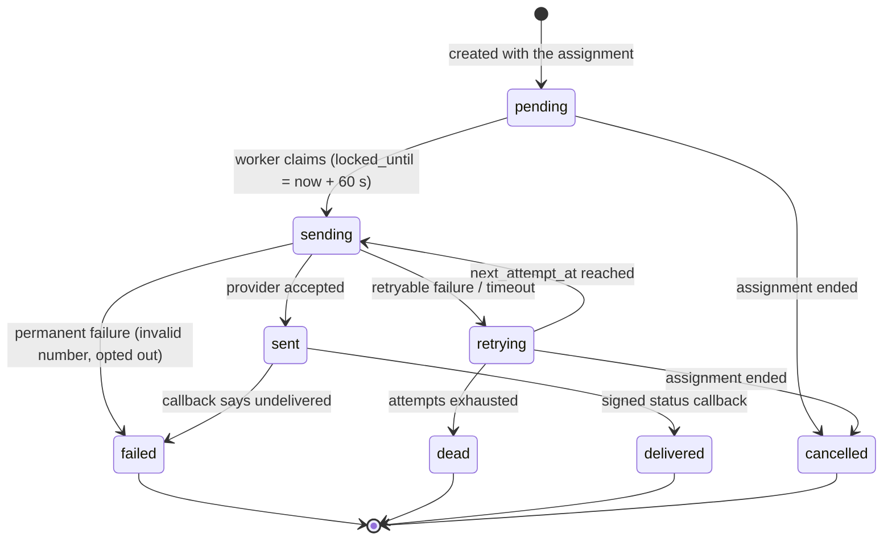

# Routing and delivery

**Status: Part 1 (routing) is built as of stage 4, with the deviations in "Stage 4 as built" below; Part 2 (delivery to businesses) is built as of stage 5, with the deviations in "Stage 5 as built" below; the stage-2 operator alert outbox was its first implementation** (see "Stage 2 as built"). Credits and charging are not implemented, with two exceptions that are real and tested: the database guarantees this
design relies on (exclusivity, caps, single charge, wallet floor, allowance), and the eligibility query
(`findEligibleClients` in `src/modules/coverage/repo.ts`, built in stage 3 with the tester that explains it). Everything else is specified precisely enough to build from.

### Stage 4 as built (routing)

`src/modules/routing` implements Part 1, **with these differences from the design below** (decisions D26-D34 in docs/00 have the reasoning):

- **One transaction, one lock.** A worker takes `pg_advisory_xact_lock` for the vertical, claims the oldest routable lead (`FOR UPDATE SKIP LOCKED`), decides, and assigns, all in one transaction. There is **no `routing` status lease, no sweeper and no per-client lock** (the "claim with compare-and-set" and "serialise per client" protections below are replaced by this): a crashed worker leaves the lead as it was. Caps and fair shares are exact. The chosen business is still share-locked and re-checked (status, coverage, caps) just before the insert, because a person can change it in the gap.
- **It assigns; it does not charge or notify.** The reservation transaction below has no wallet, ledger, allowance or notification steps (stages 5 and 6). The price is the pricing rule's, snapshotted on the assignment, and a lead with no price rule is parked (`price_required`), never given a made-up price.
- **Rules:** `routing_rules` has the shapes described below, but the filters and limiters that exist are `working_hours`, `daily_cap` and `monthly_cap`, and the rankers are `priority`, `weighted_fairness` and `least_recently_assigned` (in that default order). `min_credit` and `max_open_leads` wait for stage 6. A run stores a **snapshot** of the rules in force instead of a version number.
- **Off by default, and only for leads that arrive while it is on** (`routing_settings`), up to a maximum age.
- **`unroutable`** is entered from `new` (not from `routing`), retried every five minutes or when a client, coverage rule, hours, pause, price or rule changes, until the age limit.
- **Dry run:** `RoutingService.explain(leadId)` runs the same `analyse` function as the router, read-only and without the lock, and also lists why the router would leave the lead alone. A test proves the two agree over generated worlds.
- **Health:** `/api/pipeline` adds `routing_stalled` and `routing_failing`.

### Stage 5 as built (delivery to businesses)

`src/modules/delivery`, `src/integrations/delivery` and the worker's third loop implement Part 2 for three channels, with these differences from the design below (decisions D35-D42 in docs/00):

- **Per business and off by default** (`clients.delivery_mode`). **Every enabled channel is sent at once** (no "SMS then email after two minutes"); the assignment is `notified` when any channel is accepted, and `delivery_failed` (lead freed, router tries a different business) when every channel has given up.
- **Outbox by trigger:** `notifications` rows are created and cancelled by triggers on `lead_assignments`, so every path that assigns a lead is covered atomically. The state machine, lease (60 s), 8 attempts with the 5 s / 15 s / 45 s / 2 min / 5 min / 15 min / 30 min backoff, compare-and-set completion, `abandoned` attempts and reconciler are the alert outbox's, **copied and adapted rather than extracted** (the alert tests are its specification and extracting under them was more risk than reward; revisit at the third outbox).
- **Content:** email = the full text an operator would send by hand; text = first name, phone, area, job, urgency, reference; webhook = the full record. Built at send time; the send re-checks the assignment, erasure and consent.
- **Webhook client:** the defences of the design (https, public addresses only, pinned connection, no redirects, capped response, timeout, HMAC signature with timestamp and delivery id) are all built; the secret is stored AES-256-GCM encrypted. There is no circuit breaker.
- **Twilio:** the adapter is the sketch below with an API key, a messaging service and a status callback; the callback endpoint verifies the signature itself (hand-written, proven against Twilio's published example), applies each (provider, event) once, and keeps a report that arrives before our own bookkeeping for the reconciler.
- **The loop starts notifications without waiting for them** (a bounded pool), so one hung business holds one slot, not the queue.
- **Operator view:** "Deliveries that need you" (`/admin/deliveries`) with try-again, per-assignment delivery status on the lead page, and `/api/pipeline` codes `deliveries_overdue`, `deliveries_failing`, `deliveries_missing`. The canary lead is not built (D42).

### Stage 2 as built (operator alerts)

`operator_alerts` (migration `0002`) is the notification outbox of Part 2 specialised to one recipient group, the operators. Same lifecycle and numbers: claim with `FOR UPDATE SKIP LOCKED`, 60 s lease, 8 attempts with the
5 s / 15 s / 45 s / 2 min / 5 min / 15 min / 30 min backoff (+-20%), timeouts of 8 s capped at half the lease, a stable idempotency key per alert so a retry after a crash cannot produce a second email (**only while the payload is identical**: the provider answers the same key with a different payload 409 `invalid_idempotent_request`, so each alert's email is a pure function of immutable facts, with no clock and no current lead status, and a residual mismatch rotates to a fresh key), an append-only attempt
history (a lost attempt is recorded as `abandoned` by the reconciler), compare-and-set completion on `(status, attempt_count)`, and a reconciler that reclaims expired leases and creates anything missing.
Differences, on purpose: the statuses are `pending / sending / retrying / sent / dead / cancelled` (no `delivered` or `failed`: there are no provider callbacks yet); the recipient list comes from configuration at send time (no personal data
and no address is stored in the row); `dead` is reported by `/api/pipeline` until the lead is handled instead of freeing an assignment (there is none). Stage 5 should extract the claim/lease/backoff/completion code
shared with `operator_alerts` rather than copy it: the tests in `tests/integration/alerts-service.test.ts` are the specification to keep green.

## Part 1: the routing engine

### Shape

A standalone module `src/modules/routing` (framework-free, called only by the worker and the admin "reassign" action). It takes a
lead id and returns a decision; it never talks to Twilio or the browser. Pipeline (matches the brief's diagram):

```
claim lead  ->  load context (postcode, service, consent, price)  ->  candidates  ->  filters  ->  rank
            ->  reserve + charge + assign + create notifications (ONE transaction)  ->  record routing_run
```

| Step | Source | Notes |
| --- | --- | --- |
| Candidates | `findEligibleClients` (`src/modules/coverage`) | Postcode/coverage + service offered + client active + sale type accepted |
| Filters (kind `filter`) | `routing_rules` | Subscription active or credit balance >= price; not paused; **working hours** (client timezone); exclusions; any vertical-specific rule |
| Limiters (kind `limiter`) | `routing_rules` | Daily/monthly lead cap, max open (unanswered) leads |
| Ranker (kind `ranker`) | `routing_rules` | Default: ascending `clients.priority`, then **weighted fairness**: lowest `assigned_last_30d / weight`, then least-recently assigned, then id (deterministic) |
| Reserve | one transaction (below) | Re-checks everything under a lock; the database is the final arbiter |

### Data-driven rules (admin-editable without a deploy)

`routing_rules` rows hold `kind`, `position`, `active`, `version` and a `config jsonb`. Each rule type has a Zod schema in code
(`{ type: "min_credit", multiple: 1 }`, `{ type: "working_hours", grace_minutes: 15 }`, `{ type: "weighted_round_robin", window_days: 30 }`).
The engine is an ordered list of pure functions `(candidates, context) => { candidates, reasons }`. Editing a rule validates the config,
bumps `version` and writes `audit_logs`. Every attempt writes a `routing_runs` row: the rules version, every candidate considered, and
the reason each was excluded or its score, so "why did this lead go to X?" is a SQL query, and the admin can offer a **dry-run**
("explain routing for this lead as if now") using the same engine without committing.

New *kinds* of rule need code; new *parameters, ordering and on/off* do not. That is the right boundary.

### The race: two workers, one lead (and one client)

Three layered protections, each independently sufficient for its own failure:

1. **Claim with compare-and-set.** A worker takes a lead with
   ```sql
   UPDATE leads SET status = 'routing'
    WHERE id = (SELECT id FROM leads WHERE status IN ('new','unroutable') AND deleted_at IS NULL
                ORDER BY created_at FOR UPDATE SKIP LOCKED LIMIT 1)
   RETURNING id;
   ```
   `SKIP LOCKED` lets many workers pull *different* leads without blocking each other; the status change is the lease. A sweeper
   returns leads stuck in `routing` for > 2 minutes to `new` (compare-and-set on `status_changed_at`), so a crashed worker loses nothing.
2. **Serialise per client** for the things that depend on a client's *state* (daily cap, open leads, credit, allowance): inside the
   transaction, `SELECT ... FROM clients WHERE id = $1 FOR UPDATE` before re-checking caps. Different clients proceed in parallel; two leads
   contending for the same client queue for a few milliseconds, so the cap cannot be exceeded by a race.
3. **The schema as final arbiter.** Whatever the code believes, `lead_assignments_one_active_exclusive`, the composite sale-model
   foreign key, the shared-cap trigger, `UNIQUE (assignment_id)` on `lead_charges` and the `balance_pence >= 0` / `leads_used <= included_leads`
   CHECKs reject an invalid outcome. The worker treats `23505`, `23503`, `23514` from these as "someone else won / not allowed: try the next
   candidate or stop", never as a crash. (Proven by the 12-way and 10-way races in `tests/integration/target-schema.test.ts`.)

### The reservation transaction (pseudocode, to be implemented as `routeLead(leadId)`)

```sql
BEGIN;
  SELECT set_config('app.actor_type', 'system', true), set_config('app.request_id', $run_id, true);

  -- (claim already happened: status = 'routing')
  -- Candidates and ranking were computed OUTSIDE the lock (read-only, cheap). Now try them in order:
  FOR each candidate IN ranked order (stop at the first success; at most ~5):
    SAVEPOINT attempt;                                         -- locks taken after this are released on rollback
    SELECT ... FROM clients WHERE id = $c FOR UPDATE;          -- serialise on this client
    -- re-check under the lock: still active, not paused, within hours, under daily cap and open-lead limit
    price := resolve_price(lead, client, sale_type)            -- most specific pricing_rules row
    -- charge, cheapest source first; each is a CONDITIONAL update, so failure just means "next source"
    UPDATE subscription_periods SET leads_used = leads_used + 1 WHERE ... AND leads_used < included_leads;   -- included allowance
    -- else: UPDATE client_wallets SET balance_pence = balance_pence - price WHERE client_id = $c AND balance_pence >= price;
    UPDATE leads SET sale_model = 'exclusive', max_assignments = 1
     WHERE id = $lead AND (sale_model IS NULL OR sale_model = 'exclusive');
    INSERT INTO lead_assignments (lead_id, client_id, sale_type, assigned_by, price_pence, routing_run_id, respond_by) ...;
    INSERT INTO lead_charges (...);  INSERT INTO credit_ledger (... idempotency_key = 'assign:' || assignment_id);
    INSERT INTO notifications (...) ON CONFLICT (idempotency_key) DO NOTHING;     -- the outbox: one per channel/recipient
    UPDATE leads SET status = 'assigned' WHERE id = $lead AND status = 'routing';
    on 23505 / 23514 / insufficient funds: ROLLBACK TO attempt; next candidate
  IF none succeeded: UPDATE leads SET status = 'unroutable' WHERE id = $lead AND status = 'routing';
  INSERT INTO routing_runs (...);                              -- always, success or failure
  SELECT pg_notify('notifications_due', '');                   -- wake the delivery workers (delivered at COMMIT)
COMMIT;
```

Everything that matters (assignment, charge, ledger, notification intent, status, audit) commits together or not at all. There is no
state in which a client was charged but never told, or told but never charged. Lock order is always lead -> client, one client at a
time, so there are no lock cycles; retry on `40P01`/`40001` regardless.

**Timing:** claim + candidates + one reservation is ~10 round trips of indexed point operations; budget **< 100 ms p95** under normal
load, measured as the `routing_runs.duration_ms` column.

### Manual reassignment (admin)

One service function used by the admin UI: requires a **reason**, sets `app.actor_type = staff_user` and `app.actor_id`, ends the
current assignment (`cancelled`, which frees the lead and reverses the charge as a ledger entry), creates the new assignment with
`assigned_by = staff`, enqueues notifications, and writes an `audit_logs` row with before/after. History triggers capture the actor
automatically, so the trail cannot be skipped.

## Part 2: delivery (speed to lead)

### Queue choice

| Option | Verdict |
| --- | --- |
| **PostgreSQL outbox + `SKIP LOCKED` + `LISTEN/NOTIFY` (chosen)** | The notification row is both the work item and the audit record. Atomic with the assignment (no dual write). One system to operate. Sub-second pickup with NOTIFY, polling as the safety net. Scales to thousands of jobs/s |
| `graphile-worker` | Chosen for *generic scheduled* jobs (reconciliation, retention, reports, cron); supports enqueue inside your transaction. Not used for notification state: that stays in `notifications` |
| BullMQ + Redis | Best-in-class features (rate limiting, delayed jobs, UI). Costs a stateful dependency and re-opens the dual-write gap (needs a reconciler). Adopt if a trigger from D1 fires |
| SQS | Excellent managed durability + DLQ. On AWS only; would be fed *from* the outbox by a relay. Natural at the 100k+ stage if the platform moves to AWS |
| RabbitMQ | Rich routing we do not need; another stateful system to run. No |

### Notification lifecycle and retry policy



- **Claim:** `UPDATE notifications SET status='sending', locked_until=now()+interval '60 s', attempt_count=attempt_count+1 WHERE id IN
  (SELECT id FROM notifications WHERE status IN ('pending','retrying') AND next_attempt_at <= now() ORDER BY next_attempt_at FOR UPDATE SKIP LOCKED LIMIT $n) RETURNING *`.
- **Backoff with jitter:** retry delays 5 s, 15 s, 45 s, 2 min, 5 min, 15 min, 30 min (+-20%), `max_attempts = 8`. Speed-to-lead value decays
  quickly, so the early retries are fast and the tail is about eventual delivery, not speed.
- **Timeouts:** provider HTTP 8 s total (3 s connect); worker job 30 s; database statement 10 s. A timeout is *ambiguous* (the provider may
  have accepted), so it is retried and the message is written to tolerate a rare duplicate (it carries the lead reference).
- **Idempotency:** `notifications.idempotency_key` (`assignment:channel:recipient`) is unique, so routing retries create each notification once.
  Webhooks add `X-Leadgen-Delivery: <notification id>` so a receiver can de-duplicate. No provider-side idempotency is assumed for SMS.
- **Failure classes:** network/timeout/5xx/429 -> `retrying`; 4xx that means "this recipient cannot receive" -> `failed` immediately
  (no point retrying an invalid number) and escalate.
- **Dead-letter handling:** `dead` (and `failed` with no remaining channel) raises an alert, appears in the admin "Failed deliveries"
  queue with a one-click retry/reassign, and moves the assignment to `delivery_failed`, freeing the lead for re-routing (credit refunded as a
  ledger entry). The lead itself is never in doubt: it is in the database with a full trail.
- **Recovery (reconciler, every minute):** `sending` rows whose `locked_until` passed (worker died) -> `retrying`; `pending` older than
  60 s with no recent attempt -> alert; assignments `reserved` with no notification rows -> create them; leads `new` older than 60 s -> alert.
  Nothing depends on a job message surviving anywhere.
- **Channel policy per client:** primary + fallback, e.g. webhook then SMS, or SMS then email if not `delivered` within 2 minutes.
  "Not acknowledged in N minutes" escalation is configurable per plan (premium exclusive leads can re-route after N minutes).

### What goes in each channel

An SMS or email is not a secure channel: send the **minimum to act on**: first name, phone number, postcode district, job summary, urgency and
the reference, with a link to the authenticated dashboard for the rest. Signed webhooks and the dashboard carry the full record. Client
contact details for notifications live in `clients`/`client_integrations`; the consumer's data is read at send time and never copied
into the notification row beyond what the template needs.

### Webhook delivery to client systems

`POST` JSON to the client's HTTPS URL with `X-Leadgen-Event`, `X-Leadgen-Delivery` (idempotency id), `X-Leadgen-Timestamp` and
`X-Leadgen-Signature: sha256=HMAC_SHA256(secret, timestamp + "." + body)`. Receivers must verify the signature and reject timestamps older
than 5 minutes (replay protection). 2xx within 8 s = success; 4xx other than 408/429 = permanent; 5xx/timeout = retry. **Outbound SSRF
defence is mandatory:** https only, resolve DNS and refuse loopback/private/link-local/metadata addresses (re-check after resolution to
defeat rebinding), no redirects, response size cap, and a consecutive-failure circuit breaker that marks the integration `failing`.
Signing secrets are envelope-encrypted at rest; only a hash of API keys is stored.

### Twilio SMS adapter (design sketch; not run)

All senders implement one interface so tests and later channels need no changes to the worker:

```ts
interface SendResult { outcome: "accepted" | "retryable_failure" | "permanent_failure"; providerMessageId?: string; errorCode?: string; httpStatus?: number }
interface ChannelSender { send(message: OutboundMessage, ctx: { idempotencyKey: string; signal: AbortSignal }): Promise<SendResult> }

class TwilioSmsSender implements ChannelSender {
  async send(message, { signal }) {
    const response = await fetch(`https://api.twilio.com/2010-04-01/Accounts/${this.accountSid}/Messages.json`, {
      method: "POST",
      headers: { authorization: `Basic ${btoa(`${this.apiKeySid}:${this.apiKeySecret}`)}`, "content-type": "application/x-www-form-urlencoded" },
      body: new URLSearchParams({ To: message.to, MessagingServiceSid: this.messagingServiceSid, Body: message.body, StatusCallback: this.statusCallbackUrl }),
      signal,
    });
    if (response.status === 201) return { outcome: "accepted", providerMessageId: (await response.json()).sid, httpStatus: 201 };
    const code = (await response.json().catch(() => ({}))).code;
    if (response.status === 429 || response.status >= 500) return { outcome: "retryable_failure", errorCode: String(code ?? response.status), httpStatus: response.status };
    return { outcome: "permanent_failure", errorCode: String(code ?? response.status), httpStatus: response.status }; // e.g. 21211 invalid number, 21610 recipient opted out
  }
}
```

Operational notes: use an **API key** (not the master auth token) scoped to the app; a **Messaging Service** with a UK sender; confirm the
current UK sender-ID registration requirements with Twilio before launch; verify delivery callbacks with Twilio's official
`validateRequest` (do not hand-roll the signature check) and process each event once via `provider_events (provider, event_id)`.
Status callbacks arrive at `/api/webhooks/twilio` (signature -> insert event -> update notification), idempotent by construction.
