# Roadmap

Ten stages, strictly sequential. Each stage ends in something that can be used, tested and, where marked, **commercially validated before the
next one starts**. The order differs from the brief's example for reasons in 00-assumptions-and-decisions.md (D6): form and ingestion are one
stage, baseline fraud ships first, a manual-fulfilment inbox precedes automation, clients precede routing, billing waits for a paying client.

```mermaid
flowchart LR
  S1["1 Capture<br/>(done)"] --> S2["2 Operator alerts<br/>+ inbox (built)"] --> G1{{"Gate A:<br/>unit economics"}} --> S3["3 Clients, coverage,<br/>manual assignment (built)"] --> G2{{"Gate B:<br/>first paying client<br/>(not yet passed)"}} --> S4["4 Routing<br/>engine (built)"] --> S5["5 Instant<br/>delivery (built)"] --> S6["6 Client dashboard<br/>+ credit ledger"] --> S7["7 Stripe<br/>payments"] --> S8["8 Admin, fraud v2,<br/>privacy tooling"] --> S9["9 Attribution<br/>+ analytics"] --> S10["10 Scale and<br/>resilience"]
  classDef done fill:#dcfce7,stroke:#15803d,color:#14532d;
  classDef gate fill:#fef3c7,stroke:#b45309,color:#78350f;
  class S1,S2,S3,S4,S5 done;
  class G1,G2 gate;
```

**Business gates** (suggested thresholds, set your own numbers): *Gate A* after stage 2, spend a small test budget with manual fulfilment and
compute **cost per lead, valid-lead rate and what a roofer will actually pay per lead they judge good**. If cost per good lead is not comfortably
below price, no amount of engineering fixes it: change targeting/offer first. *Gate B* after stage 3: at least one roofer paying per lead and giving
outcome feedback; only then build automatic routing.

---

## Stage 1: Lead capture: **DONE**

- **Built:** landing page; six-step mobile-first form (progressive disclosure, persistence, instant client validation, accessibility, double-submit
  protection, retries with idempotency); `POST /api/v1/leads` (controller -> service -> repository; origin check, size cap, burst limit, Turnstile,
  postcode and footprint validation, duplicate prevention, fraud scoring, one transaction for lead + contact + consent + attribution + signals + events);
  coverage check endpoint; schema 0001 with lifecycle triggers, append-only evidence, least-privilege role; seeds; ONSPD importer; privacy and terms drafts; CI.
- **Why it matters:** it is the only part visitors and ad platforms touch, and the part where a lost or duplicated lead is unrecoverable.
- **Depends on:** nothing.
- **Acceptance (all verified):** a visitor completes the journey on a phone and gets a reference; exactly one lead is stored even on double-click, dropped
  connection + retry, or 12 concurrent identical requests; 8 concurrent submissions of the same job yield one live lead and seven duplicates;
  invalid postcodes/phones/emails rejected server-side; out-of-area told immediately; consent version, time, page and IP recorded and a lead cannot commit
  without it; bots and machine-speed submissions are held or rejected without telling them; no personal data in events or logs; axe WCAG 2.2 AA clean on every step;
  Lighthouse mobile 98 / 100 / 96.
- **Tests:** 425 unit/component/integration (including 22 race tests for stages 3-7) and 41 end-to-end.
- **Not built:** delivery to anyone, accounts, any admin UI, routing, billing, analytics tags.

## Stage 2: Operator alerts and inbox (manual fulfilment) + worker foundation: **BUILT** (code verified locally; go-live needs accounts)

- **Built:**
  - **Worker process** (`npm run worker`, `src/workers/`): LISTEN/NOTIFY wake-up, a poll as the safety net, a reconciler tick, a heartbeat, graceful shutdown. Decision D14: the queue is the `operator_alerts` Postgres outbox, not graphile-worker.
  - **Alerts**: one row per (lead, kind) written **in the lead's own transaction**; delivered with a 60 s lease, 8 attempts with backoff (5 s to 30 min), provider-side idempotency, compare-and-set completion, a dead state that `/api/pipeline` reports; an email per `new` lead, per `held` lead (flagged) and one **reminder** if a lead is still unhandled after 15 minutes. The email carries no contact details (D15).
  - **Reconciler**: reclaims alerts whose worker disappeared, creates any alert that is missing for a new/held lead older than 60 s (and logs loudly, because that should never happen), queues reminders.
  - **Inbox** (`/admin/leads`, `/admin/leads/[id]`): Needs action / Handled / Screened out views, newest first, contact details only on a lead's own page, approve or reject held leads (closed reason codes, the operator recorded by the database trigger), mark handled, the lead's timeline, screening signals and alert state. Works on a phone; axe WCAG 2.2 AA clean.
  - **Access control** (D16): Cloudflare Access token verified in the app + allowlist, in `proxy.ts` and again in every page and action.
  - **Observability**: `GET /api/pipeline` (worker alive, no overdue or dead alert, no lead left without an alert) for an uptime monitor; Sentry with personal data scrubbed (D18); structured logs with ids only.
  - **Backups**: `scripts/backup.sh` (dump, verify, checksum, encrypt, copy) and `scripts/restore-drill.sh` (restore into a scratch database and compare with the source).
  - **Runbook** (`docs/runbook.md`): provisioning Railway, Cloudflare Access, Resend, Sentry and the uptime monitors; first-run verification; incident procedures.
- **Why:** it makes stage 1 usable: the first leads can be sold by hand over WhatsApp, validating the business before any marketplace code exists.
- **Not built yet because it needs something only you can provide:** a Resend (or other email) account and a verified sending domain; Railway and Cloudflare provisioned; a domain; a Sentry project; an uptime monitor; the real company details and the solicitor's sign-off (`LEGAL_TEXT_REVIEWED`); the first roofers. None of the code assumes a particular answer, and the production configuration refuses to start without the settings these need.
- **Acceptance, as verified locally (see 06-operations.md for how and what the numbers mean):**
  - *lead -> operator email p95 < 10 s*: measured at 12 ms (p50) and 16 ms (p95) of our own overhead with a zero-latency provider, and 266 / 271 ms with a 250 ms provider, one lead every 2 s. **The real figure is that plus the provider's latency and the network distance, which were not measurable here.**
  - *kill the worker mid-send and the alert is still delivered exactly once or retried, never lost*: a real worker process is `SIGKILL`ed while the provider has accepted the email but not yet answered; a replacement worker reclaims the lease and retries with the same idempotency key, and the provider ends with exactly one email (tested at process level, mutation-checked). This holds because the retry's payload is identical (the provider only deduplicates identical payloads: see D-notes in 00, section 3); a retry whose payload still differs rotates the key and may duplicate one email, never lose it. **Timing in production:** the stranded alert is retried after its lease expires (60 s) at the next reconciler tick (15 s), so at most about 75 s late; the tests shorten the lease to 3 s.
  - *a `new` lead nobody saw triggers an alert within 2 minutes*: the reconciler creates and sends the missing alert (tested with the alert row deleted: it arrives within the 60 s grace plus one 15 s tick, so about 75 s worst case). A reminder follows at 15 minutes if the lead is still unhandled.
  - *held lead approve/reject writes status history with the staff actor*: enforced by a database trigger, tested including 10 simultaneous decisions (exactly one wins).
  - *a restore from backup is rehearsed*: rehearsed locally (dump, verify, restore into a scratch database, row counts equal the source, a truncated dump fails the drill). **Not yet rehearsed against R2 with encryption**, which needs your accounts.
- **Tests:** worker crash/restart (real process), provider 500s/timeouts/permanent failures, duplicate delivery, personal data absent from emails, tables and logs, Access-token attacks (alg none, HS256 confusion, wrong audience/issuer, expired, unsigned, tampered, service token), inbox races, structural test that every admin entry point authenticates.
- **Do NOT build:** clients table, routing, SMS/WhatsApp, client logins, billing. (Still true: none of these exist.)
- **Manual-fulfilment rules until stage 3** (no assignment record exists yet): the consent allows one business per lead, and a data-subject request needs "who received my details". **Keep a log (reference, business, time) of every lead you pass on**, and mark the lead handled in the inbox once you have.

## Stage 3: Clients, coverage and manual assignment: **BUILT** (code verified locally; Gate A is yours to run)

**Gate A (a small paid test with real roofers) is a business test only you can run, and nothing in stage 3 depends on its result**, so it was built without waiting. What stage 3 buys regardless of the outcome: a record of which business received which lead (the consent allows one, and a data-subject request needs the answer), and the rules the first manual sales will teach.

- **Built:**
  - **Clients** (`/admin/clients`): create and edit a business, give it services and **coverage rules** (postcode district, sector, prefix, named area, radius from a postcode; include or exclude), and move it through `prospect / active / paused / suspended / churned`. A client cannot become `active` without at least one service and one include rule, and cannot lose its last one while active. Pausing, suspending and churning need a reason from a closed list.
  - **Coverage tester** (`/admin/coverage`): the real eligibility query, not a copy of it, and for every client the reason it was or was not eligible. Assignment uses the same code (`src/modules/coverage`), so the tester cannot disagree with what assignment does.
  - **Pricing** (`/admin/pricing`): flat price per lead, by service, area, urgency and exclusive/shared; the most specific rule wins; setting a price ends the old rule and starts the new one (history is immutable, enforced by a trigger). An assignment copies its price, so later changes never rewrite history. No rule means the operator is asked for a price at assignment.
  - **Manual assignment** (lead page): assign a `new` lead to a business, copy the ready-made message (the one place the contact details are assembled for a business), mark it sent, take it back, or **move it to another business with a mandatory reason**. A business that does not cover the postcode is refused with the reasons unless the operator ticks an exception, which is recorded.
  - **Privacy tool** (lead page): any operator can record **consent withdrawn** (closes the lead, takes it back from the business, lists the businesses to tell); an **owner** can **erase** a person (contact details and postcode blanked, lead marked invalid). Both write a **suppression** (a keyed HMAC of the email and phone, never the plain values) so the same person is not assigned again, and survive a backup restore (`npm run ops:replay-erasures`).
  - **Audit** (`audit_logs`): append-only; every client, coverage, pricing, assignment and privacy change has actor, action, reason and before/after, never a consumer's personal data (a deny-list refuses it).
  - **Roles:** `owner` (in `ADMIN_OWNER_EMAILS`) and `staff` (everyone else on the allowlist). Only owners can erase.
- **Deviation from the text of this stage:** no Better Auth and no in-app MFA. Staff already sign in through Cloudflare Access (D16) and **Access enforces MFA**, so a second login system would add a second way in; staff and owners are recorded in `operators`. `users`/`client_users` arrive with client logins in stage 6. D19 has the reasoning and what would reverse it.
- **Deviation from the schema design:** `client_working_hours` and the routing-only columns are stage 4's and stay in `docs/design/target-schema.sql`. A manual operator needs none of them.
- **Acceptance, as verified locally:**
  - *staff can create a client with district, sector and radius coverage*: tested through the UI, the service and the database (`tests/e2e/stage3.spec.ts`, `tests/integration/clients.test.ts`).
  - *the coverage tester agrees with the query tests*: both call the same function; `tests/integration/coverage.test.ts` covers include/exclude, sector, prefix, area, radius and the reasons.
  - *two staff assigning the same lead at once -> exactly one wins*: concurrent tests at the service and the SQL level, and the database refuses a second active exclusive assignment on its own (partial unique index). The protections were mutation-checked (removed one at a time; a test fails). Two mutants survived because the database enforces the same rule a second time (the service check is backed by the unique index and the compare-and-set), so removing only one layer changes nothing observable; that is the design, not a gap.
  - *every change has an audit row with actor and reason*: asserted in each service test and end to end (the browser test reads `audit_logs` for the whole assign / send / take back / move journey).
  - *erase/withdraw works and is replay-safe*: erasing twice is a no-op; erasure after a restore is replayed from the retained log lines; suppression takes effect at assignment even when the person was suppressed after the lead was created.
  - *MFA enforced for staff*: **not enforced by this application**; it is a setting in the Cloudflare Access policy that `docs/runbook.md` makes the first thing to verify (log in with only the first factor and confirm it fails). **Not testable here.**
- **Tests:** 811 unit, component and integration tests (50 files; run against a real PostgreSQL, per-file cloned databases, the restricted application role) and 91 end-to-end tests on phone and desktop, 1 skipped by design (a keyboard test that is desktop-only). Stage 3 adds the database-guard suite, 25 concurrent creates against a 10-connection pool (the pool-deadlock regression), races between assign, cancel and reassign, privacy and replay tests (8 simultaneous erasures leave one record), a source-level test that every admin function authenticates, and axe WCAG 2.2 AA checks on every new page.
- **Do NOT build (still true):** automatic routing, credits/charging, client dashboard, client logins, SMS/WhatsApp.
- **Until it is deployed:** keep the manual-fulfilment log from stage 2 (reference, business, time).

## Stage 4: Automatic routing engine: **BUILT** (code verified locally; **Gate B was not passed first**)

You asked for stage 4 before a roofer was paying. It is built so that being wrong about the defaults is cheap: **routing is off until an owner switches it on**, every rule is editable data, and every decision (and non-decision) can be explained. Treat the default rules as a first guess to correct with what the first real roofers tell you.

- **Built:**
  - **The router** (`src/modules/routing`, run by the worker): claims the oldest routable lead, decides and assigns in **one transaction under one advisory lock** (decision D27, a deliberate simplification of the design below: no lease, no sweeper, no per-client locks), re-checks the chosen business just before assigning, and records a **run** for every attempt: the rules in force, a verdict and rank for every business that covers the lead, the price, how long it took.
  - **Rules as data** (`/admin/routing`, owner-only, versioned, audited): working hours, daily and monthly caps, and the tie-breakers priority, fair share by weight over a window, and longest wait, in an editable order. What must always hold is **not** a rule (active, covers the postcode, pause, "manual only", "gave it back", consent, suppression, a price).
  - **What a business asked for** (client page, "Automatic leads"): priority, weight (0 = manual only), most leads a day and a month, working hours per weekday and pauses, all in the business's own time zone.
  - **Leads nobody can take** are parked as `unroutable` with a run that says why, announced once, retried when something changes or after five minutes (up to an age limit), and can be handed over by hand.
  - **Take-backs:** declined, no answer, wrong area or unavailable re-routes to a different business automatically; quality, consumer request or other stops automatic routing for that lead.
  - **Dry run** ("Who would get this lead if the router looked at it now?"): the same decision code, read-only, plus why the router would leave the lead alone.
  - **Visibility:** Needs action now includes unroutable leads and **assigned leads not yet sent** (the router assigns; a person still sends until stage 5), the reminder email covers them, and `/api/pipeline` reports `routing_stalled` and `routing_failing`.
  - **Also fixed:** a killed database connection no longer crashes the process (D34), and the module-boundary lint rule that was overdue now exists.
- **Not built (still true):** delivery to the business (stage 5), credits, charging and `max_open_leads` (stage 6), shared leads, client logins.
- **Acceptance, as verified locally:**
  - *routing p95 < 100 ms* (`routing_runs.duration_ms`): measured on the real worker process against a real PostgreSQL on one machine (`tests/load/routing-latency.mts`, three active businesses, one capped). The decision (`duration_ms`, which includes waiting for the routing lock) was **p50 28 ms, p95 40 ms, max 66 ms** at one lead every 2 s (25 leads) and **p95 40 ms** at ten leads a second (100 leads). A burst of 300 at once had a decision p95 of **11 ms** with one worker and **30 ms (max 117 ms)** with three: more workers cannot go faster because the lock serialises them, by design. A first run against about 70 candidate businesses (the cloned development data) gave a p95 of 41 ms. The burst drained at about **93 leads a second** including creating them; the last lead of a 300-lead burst waited about 2.8 s for its turn (time from stored to the router starting on it; `assignment.created_at` is the transaction's start time, so the total is that plus the decision). **Correctness under that load:** 725 leads gave 303 / 302 and exactly 120 to the capped business, none held twice, none left unassigned, no routing errors. What this does not include: network distance to a managed database, or a database under other load
  - *N workers x M leads never double-assign and never exceed a client's cap*: 6 concurrent routers with their own pools over 90 leads and 3 businesses (one capped at 20) gave the capped business exactly 20 and shared the remaining 70 between the other two to within one lead; no lead was ever held twice; and the same holds for assigning by hand or withdrawing consent at the same moment. Removing the routing lock makes the harness fail (mutation-checked).
  - *a crashed worker's lead is recovered*: a router whose database connection was killed mid-transaction, and a real worker process SIGKILLed while blocked mid-route, both left the lead exactly as it was (still `new`, no run, no assignment); the next worker assigned it. There is nothing to recover because nothing was half done.
  - *every decision explainable from `routing_runs`*: each run stores the rules in force and a verdict for every candidate; a test asserts that no personal data appears in a run, an event or the history.
  - *changing a rule needs no deploy*: rules are edited in the admin, versioned (a stale edit is refused) and audited; disabling a rule changes the next decision.
  - *explain/dry-run parity*: asserted over six generated worlds of 30 leads each (businesses with random priorities, weights, caps, hours and pauses): same choice, same ranking, same verdict for every business, and the explanation writes nothing.
  - *fairness distribution*: a pure simulation hands out 700 leads in proportion to weight 1:1:2:3 to within one lead and never to a manual-only business; the integration test gives 6:12:18 for weights 1:2:3.
- **Tests:** 125 new unit and integration tests (936 in total) and 18 new browser tests on phone and desktop (109 in total, 1 skipped by design). **Mutation checks:** 51 deliberate breakages of the router, its SQL and the engine; 49 made a test fail; one survivor is an equivalent redundancy (the status re-check under the lock duplicates the coverage re-check) and one was a no-op I wrote by mistake. Found by the tests, not by thinking: weak tests for the weekday and the retry spacing (strengthened), and the killed-connection crash (fixed).
- **Not verified:** nothing has run on a real deployment (the NOTIFY wake-up, `lock_timeout` under a managed database's limits, the restart policy); latency was measured on one machine, so the network distance to a managed database is not included; the defaults are guesses (Gate B).
- **Do NOT build (still true):** charging, SMS, shared leads.

## Stage 5: Instant delivery: **BUILT** (code verified locally; nothing has run against Twilio, a real receiver, a real sending domain or Railway)

Delivery is **off per business until an owner switches it on** (`manual` is the default, so everything built so far behaves exactly as before). A business on `automatic` is told about its lead the moment the assignment commits, by every channel it enabled.

- **Built:**
  - **The outbox** (`notifications`, migration 0006): a database trigger on `lead_assignments` writes one row per enabled channel **in the assignment's own transaction**, so "assigned but nobody told" cannot happen for a business on automatic delivery, whichever path assigned (router, operator, reassignment). Another trigger cancels what has not gone out when the assignment ends. Unique per (assignment, channel).
  - **Three channels** behind one interface (`src/modules/delivery`, `src/integrations/delivery`): **email** (the full handover text, the same one an operator would send), **SMS via Twilio** (minimum to act on, plus a status callback) and a **signed webhook** (HMAC-SHA256 over `timestamp.body`, a delivery id header the receiver can de-duplicate on, SSRF defences, no redirects, 64 KB cap, 8 s timeout). The webhook secret is stored AES-256-GCM encrypted, shown once when generated.
  - **Reliability:** a 60 s lease, 8 attempts with backoff (5 s to 30 min), compare-and-set completion, an `abandoned` attempt record when a worker vanishes, a reconciler, LISTEN/NOTIFY plus polling, and a bounded worker pool so one business whose server hangs holds one slot, not the queue (D41). Lock order is always lead, assignment, notification.
  - **What delivery means for the assignment** (D38): the first channel accepted moves it to `notified`. If every channel gives up, it becomes `delivery_failed`, the lead is freed, and the router gives it to a different business (or, with routing off, it returns to `new`).
  - **Twilio status callbacks** (`/api/webhooks/twilio`): signature hand-verified, each event processed once (`provider_events`), events that arrive before we know the message id are applied later by the reconciler, only status and error code stored.
  - **Operator surfaces:** delivery settings on the client page (channels, webhook URL, secret generation), a "Deliveries that need you" queue with try-again, delivery status on the lead page, and `/api/pipeline` codes `deliveries_overdue`, `deliveries_failing`, `deliveries_missing`.
- **Not built, on purpose:** a canary lead (D42: the pipeline health codes report a stuck pipeline from facts), sequenced fallback between channels (D35), WhatsApp, the client dashboard, payments.
- **Acceptance, as verified locally:**
  - *with the provider down nothing is lost*: failures are retried with backoff and delivered after recovery (provider fault injection in `tests/integration/delivery.test.ts`).
  - *exhausted retries reach the failed-delivery queue and free the lead*: tested through the service and with a real worker process against a receiver answering 410.
  - *a duplicated or killed worker never double-sends beyond at-least-once*: a real worker SIGKILLed mid-send while the business's server hangs; the replacement delivers after the lease expires, with the **same delivery id** so a receiver can de-duplicate. Duplicate texts are possible in that window and are documented (D40).
  - *forged callbacks rejected*: missing, wrong, truncated and other-token signatures all give 403; with no auth token configured the endpoint answers 503 to everything.
  - *SSRF*: private, loopback, link-local, metadata, CGNAT, multicast and IPv4-in-IPv6 addresses are refused, the name is resolved once and the connection pinned to that address (no rebinding), redirects are never followed.
  - *assignment to first attempt p95 < 3 s*: **not measured as a percentile.** The real-process test asserts all three channels go out within 5 s of assignment, and the wake-up is NOTIFY-driven. A load figure still needs measuring (as `tests/load/alert-latency.mts` does for alerts).
- **Tests:** 116 new unit and integration tests (1,052 in total at the last full run) plus new browser tests. **Mutation checks:** 57 deliberate breakages of the delivery code, the SSRF guard, the webhook signature, Twilio verification, secret encryption and the settings; all were killed except two equivalent mutants (a short-circuit that only saves a query, and an IPv6 zone-id strip that fails safe). Found by the tests, not by thinking: one hung business delaying every other delivery (fixed, D41); settling on the first failure while other channels were pending; accepting a retry with a wrong idempotency key.
- **Also fixed while finishing this stage (found by repeating the full suite under load):** a real race in pricing (a price change whose transaction began before another committed could leave two current rules: `now()` is the transaction's start, so the new moment is now read after the lock); the worker could write its heartbeat back after a clean shutdown; and in development the postcode check was refused from any port other than the one `APP_URL` names.
- **Not verified:** nothing has run against real Twilio (UK sender registration), a real webhook receiver, a verified sending domain or Railway; texts are at-least-once; one failure seen once in the full suite (a freed lead found `assigned` after `delivery_failed`, in a real-worker test) has not recurred in more than ten full runs since the assertion was made to print the lead's history, and its cause is not established.
- **You need to provide before go-live:** a Twilio account and UK sender, `TWILIO_AUTH_TOKEN`, `DELIVERY_SECRETS_KEY` (32 random bytes, base64), a verified sending domain, and a decision on which businesses to switch to automatic.
- **Do NOT build (still true):** the client dashboard, payments.

## Stage 6: Client dashboard and credit ledger

- **Build:** client authentication (passwordless), tenant-scoped repositories and RLS; dashboard per 05 (new leads, detail, accept/reject, outcomes, disputes, service-area view, notification settings, spend and performance counts);
  `client_wallets`, `credit_ledger`, `lead_charges` and the **charge waterfall at assignment**; staff-granted credit; refunds as ledger entries; nightly wallet-vs-ledger reconciliation.
- **Why:** clients need to see and act on leads, and money correctness is the part of the schema that cannot be retrofitted.
- **Depends on:** stage 5; a few clients using it manually.
- **Acceptance:** a client can never see another client's lead (cross-tenant tests); concurrent charges never overdraw or double-charge; a refunded lead frees the assignment; reconciliation finds zero drift under load.
- **Test:** cross-tenant authorisation matrix; race tests on the real charge path; ledger idempotency; dispute and refund flows.
- **Do NOT build:** Stripe, subscriptions, API keys, analytics charts.

## Stage 7: Payments and subscriptions

- **Build:** Stripe Checkout top-ups; Stripe webhooks through `provider_events`; `payments`; plans and subscriptions with period allowances (models B-D); invoices as Stripe-hosted links; dunning and `past_due` behaviour in routing filters.
- **Why:** only worth building once manual invoicing hurts (Gate: at least ~3 paying clients).
- **Depends on:** stage 6; Stripe account; accountant input on VAT.
- **Acceptance:** a replayed webhook creates nothing new; a top-up credits exactly once; a client with no allowance and no credit is skipped by routing; subscription state drives eligibility.
- **Test:** webhook replay/forgery, concurrent top-up and charge, period rollover, failed payment paths.
- **Do NOT build:** custom invoicing, proration engines, multi-currency.

## Stage 8: Admin completion, fraud v2, privacy tooling

- **Build:** the full admin per 05 (pricing and routing-rule editors, dispute workflow, fraud queue and blocklist, notification/webhook consoles, system health, audit explorer); fraud v2 (blocklist checks, async email/phone enrichment,
  optional SMS verification tier, weight table); privacy: automated retention job from `RETENTION`, subject-access export, DSR tracker with due dates; client API keys and webhook self-service.
- **Why:** reduces operator toil and bad-lead disputes, and makes the privacy promises automatic instead of manual.
- **Depends on:** stage 7 (or 6) and real held/dispute volume to tune against.
- **Acceptance:** retention job leaves no personal data past policy and is replay-safe; export covers every table; fraud false-positive rate measured against disputes; admin actions all audited.
- **Test:** retention boundary tests, erasure with backups-replay drill, SSRF/signature tests for self-service webhooks.
- **Do NOT build:** ML scoring (tune weights first), a bespoke BI tool.

## Stage 9: Attribution and analytics

- **Build:** ad-spend import (Google Ads, Meta) into `ad_spend_daily`, click-level `gclid` import, campaign resolution job, `v_campaign_funnel_daily` dashboards, offline conversion upload (sold leads, won jobs), first-party funnel events and web-vitals RUM,
  a consent platform **before** any ad/analytics tag, client ROI reporting.
- **Why:** turns ad spend into a closed loop: bid on sold leads, not form fills.
- **Depends on:** stage 6 outcomes data and stable volume.
- **Acceptance:** spend, leads, valid, sold, revenue, CPL, ROAS reconcile with the platforms and the ledger; tags fire only with consent.
- **Test:** import idempotency, attribution join correctness, consent-gated tag tests.
- **Do NOT build:** a custom attribution model beyond last-click/UTM.

## Stage 10: Scale and resilience

- **Build (only the items whose trigger fired; see 01):** monthly partitions for event/audit/attempt tables, PgBouncer for web, managed HA Postgres with PITR, read replica for analytics, per-provider concurrency limits, SMS cost optimisation,
  load and chaos testing in staging, on-call process; queue to SQS/BullMQ only if the D1 triggers are met.
- **Acceptance:** documented capacity at 10x peak with zero lost leads and zero duplicate assignments under fault injection; restore time and data-loss window measured and acceptable.
- **Do NOT build:** microservices, multi-region, or anything not demanded by a measured trigger.
