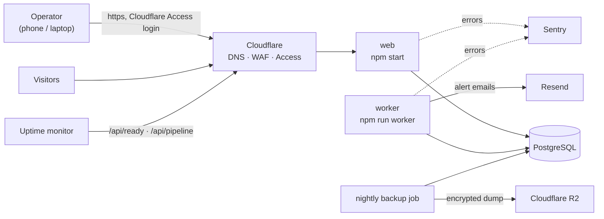

# Runbook: running the platform (stages 1-5)

How to stand the system up, prove each piece works, deploy changes, and what to do when something breaks.

**Honesty about what has been run.** Everything in this document that touches a real service (Railway, Cloudflare, Resend, Sentry, R2, an uptime monitor)
was written from those services' documentation and has **not been executed**: no accounts existed when it was written. The documented behaviours the code relies on were re-read against the vendors' docs on 2026-10-05
(see docs/00, section 3, for what matched and the one flaw this found). Steps are marked **[unverified]** where the exact button or setting may differ.
The *code* paths behind them are tested against local stand-ins (06-operations.md, section 3). Treat "First-run verification" below as the moment the unverified parts become verified: do not
skip it, and do not send paid traffic until it passes.

## 1. What runs where



| Service | Command | Public? | Needs |
| --- | --- | --- | --- |
| **web** | build `npm run build`, start `npm start` | yes, behind Cloudflare | database, Turnstile keys, Access settings, brand/legal settings |
| **worker** | start `npm run worker` | **no** (no domain, no port) | database, email provider, alert recipients |
| **PostgreSQL** | managed by the platform | **no** (private network only) | roles from `db/roles.sql` |
| **backup job** | `bash scripts/backup.sh` on a nightly schedule | no | a Postgres client, `age`, and the S3 CLI (not part of the app image) |

The worker may run as several copies; everything it does is safe to repeat. One copy is enough, and **a dead worker is the failure to watch**: the web process stays healthy while no alert goes out. That is what `/api/pipeline` is for.

## 2. Environment variables per service

All are documented in `.env.example`. Secrets live in the platform's secret store, never in the repository. Both processes refuse to start with bad configuration and print the **names** of the bad settings, never their values.

| Variable | web | worker | Notes |
| --- | :-: | :-: | --- |
| `APP_ENV=production`, `APP_URL` (https) | x | x | `staging` for the staging project |
| `DATABASE_URL` (as **`leadgen_app`**), `DATABASE_SSL` | x | x | the least-privilege role; migrations use `DATABASE_MIGRATION_URL` (owner) at deploy time only |
| `TURNSTILE_SITE_KEY`, `TURNSTILE_SECRET_KEY` | x | | real keys: the test keys are refused |
| `BRAND_*`, `LEGAL_TEXT_REVIEWED=true` | x | | placeholders refused in production |
| `TRUST_PROXY=cloudflare`, `ORIGIN_SHARED_SECRET` | x | | see 06-operations.md, "Lock the origin" |
| `CF_ACCESS_TEAM_DOMAIN`, `CF_ACCESS_AUD`, `ADMIN_ALLOWED_EMAILS` | x | | the inbox is closed without them |
| `ADMIN_OWNER_EMAILS` | x | | who may **erase** a person (owners are implicitly allowed in); required when deployed |
| `PRIVACY_HASH_KEY` | x | x | 32+ random characters; keys the "do not contact again" list. **Never rotate; back it up apart from the database** (section 8); also needed by `ops:replay-erasures` |
| `ADMIN_BASE_URL` | x | x | the admin host, e.g. `https://admin.example.com` (the link in alert emails) |
| `EMAIL_PROVIDER=resend`, `RESEND_API_KEY`, `EMAIL_FROM`, `OPERATOR_ALERT_EMAILS` | | x | recipients are read at send time: changing them needs a worker restart, not a migration |
| `ALERT_REMINDER_MINUTES` | | x | default 15 |
| `DELIVERY_SECRETS_KEY` | x | x | 32 random bytes, base64 (`openssl rand -base64 32`). Encrypts each business's webhook signing secret; the web service creates them and the worker signs with them, so **the same value on both**. Back it up apart from the database: losing it means every business must be given a new secret |
| `TWILIO_ACCOUNT_SID`, `TWILIO_API_KEY_SID`, `TWILIO_API_KEY_SECRET`, `TWILIO_MESSAGING_SERVICE_SID` | | x | all four or none. An **API key**, not the account auth token. Text messages are unavailable without them (a business with texts ticked then shows "not set up on the server" in Deliveries) |
| `TWILIO_AUTH_TOKEN` | x | | verifies Twilio's delivery reports at `/api/webhooks/twilio`; without it the endpoint answers 503 and texts are never confirmed |
| `PRIVACY_HASH_KEY` | x | x | **the worker needs it too since stage 4**: the router checks suppressions with it, so it must be the SAME key as the web service's or a suppression made there is invisible here. The worker refuses to start without it when deployed |
| `SENTRY_DSN` | x | x | required in production |
| `WORKER_*` | | | timing knobs: **leave unset** (the defaults are the tested ones) |

## 3. Provisioning, in order

1. **Domain and Cloudflare.** Put the domain on Cloudflare (proxied), SSL mode Full (strict), origin certificate, HSTS. Follow "Edge, DNS, TLS, CDN, WAF" in 06-operations.md, including the origin lock (`X-Origin-Verify`). Create two hostnames pointing at the web service: the public one (`www`) and the admin one (`admin`). **[unverified]**
2. **Railway project.** Create a project with a PostgreSQL service, a **web** service and a **worker** service from this repository. Run `db/roles.sql` once as the admin user (it creates `leadgen_app`). Settings, wherever your Railway version puts them **[unverified]**:
   - web: build `npm run build`; start `npm start`; **pre-deploy command** `npm run db:setup` (migrations then idempotent seeds, with `DATABASE_MIGRATION_URL` set to the owner connection); health check path `/api/ready`.
   - worker: start command `npm run worker`; no public domain; **no health-check path** (it serves no HTTP). Restart policy: always (a crash must restart it).
   - Postgres: private networking only; no public TCP proxy.
3. **Postcode data.** `npm run postcodes:import -- <ONSPD file> --areas BR,DA,TN --edition <yyyy-mm>` (see README). `/api/ready` stays not-ready until it is loaded.
4. **Cloudflare Access for the admin host.** Zero Trust > Access > Applications > Add > Self-hosted. Application domain `admin.<your-domain>`. Policy: **Allow**, include only the operators' email addresses (or your identity provider's group), and **require MFA**. This is where MFA for staff is enforced: the app cannot see whether a second factor was used (D19 in docs/00), so verification #15 below is not optional. Use the identity provider's own MFA, or Access's setting that requires it **[unverified: the exact option name]**. Session duration: choose deliberately (longer is friendlier on a phone, shorter is safer). After saving:
   - **Audience tag**: the application's Overview page -> "Application Audience (AUD) Tag" -> `CF_ACCESS_AUD`.
   - **Team domain**: `<team>.cloudflareaccess.com` -> `CF_ACCESS_TEAM_DOMAIN`.
   - Put the same operator emails in `ADMIN_ALLOWED_EMAILS`, and the people who may erase personal data in `ADMIN_OWNER_EMAILS`. (Both must agree: Access decides who may reach the page, the app independently decides who may use it.)
   - Add a Cloudflare WAF rule that **blocks `/admin*` on the public hostname**: defence in depth, so the inbox is not even addressable there. (The app refuses it anyway: no valid token, no entry.)
5. **Resend.** Create an account, add your sending domain, publish the DNS records it shows (SPF, DKIM), and wait for "verified". Add a DMARC record. Create an API key with sending access only -> `RESEND_API_KEY`; `EMAIL_FROM="Your Brand Alerts <alerts@mail.your-domain>"`; `OPERATOR_ALERT_EMAILS` = the people who must see leads. Use a dedicated sending subdomain so alert mail cannot damage your main domain's reputation. Resend's documented default limit is 10 requests per second per team, and the **free plan has a daily sending quota** (a `daily_quota_exceeded` 429 is retried but will not clear within the retry window, so a busy day can make alerts go `dead`): use a paid plan once real leads arrive. **[unverified]**
6. **Sentry.** Create a project (Node), copy its DSN -> `SENTRY_DSN` on both services. Add an alert rule that emails or messages you on any new issue. **[unverified]**
7. **Uptime monitors** (Better Stack, UptimeRobot or similar), every minute, alerting a phone that someone looks at:
   - `https://<public host>/api/ready` expecting HTTP 200.
   - `https://<public host>/api/pipeline` expecting HTTP 200 **and the text `"status":"ok"`**. This is the one that notices a dead worker. It is public and carries only problem codes.
8. **Backups.** Create an R2 bucket with a lifecycle rule (30 days to start), an access key limited to that bucket **without delete rights**, an `age` key pair (`age-keygen`; keep the private key **off** the platform, in a password manager the owner controls), and a nightly scheduled job that runs `scripts/backup.sh` with `BACKUP_DATABASE_URL` (a role that can read everything), `BACKUP_DEST=s3://<bucket>/leadgen`, `R2_ENDPOINT_URL`, `AWS_*` and `AGE_RECIPIENT` (the **public** key). The job's image needs `pg_dump` 17, `age` and the AWS CLI. **[unverified]**

## 4. First-run verification (do all of it, in staging, before any real lead)

Each line is something that was only ever tested against a stand-in. Tick them off in order.

| # | Do this | You should see | If not |
| --- | --- | --- | --- |
| 1 | Open `/api/ready` | 200, all checks `ok` | postcodes not imported, or the consent archive disagrees (`npm run db:seed`) |
| 2 | Wait 20 s after the worker starts, open `/api/pipeline` | 200 `{"status":"ok"}` | `worker_stale`: the worker is not running or cannot reach the database; check its logs |
| 3 | From the worker service shell: `npm run ops:email-smoke` | "accepted by the provider", and an email in the operators' inboxes **not in spam**, from the right sender name | `restricted_api_key` / 403: the key or sending domain. `validation_error` / 422: `EMAIL_FROM` |
| 4 | From either service: `npm run ops:sentry-smoke` | "event sent", and an event tagged `smoke=true` in Sentry **containing no request, user or personal data** | check the DSN and the network egress |
| 5 | `curl -i https://<public host>/admin/leads` (the PUBLIC hostname, which Access does not cover, with no login) | **403**: either Cloudflare's block rule or the app's own plain-text `Forbidden`. It must **never** return a page. (On the admin host, Cloudflare Access answers first with its login redirect, so a bare request cannot test the app's gate there; that gate is tested in CI with real signed tokens.) | the proxy is not running, or the origin is reachable around Cloudflare: check the deployment and the origin lock |
| 6 | Open the admin host in a browser, sign in with an allowlisted email | the inbox opens; "Signed in as" shows your email | 403 after login: the email is not in `ADMIN_ALLOWED_EMAILS`, or the audience tag is wrong (check the web logs for `bad_audience`) |
| 7 | Sign in with a **different** email that Access also admits (add one temporarily) | 403 | the allowlist is not being applied |
| 8 | Submit a test lead through the public form | an alert email within seconds; the link opens that lead; the list shows "Email sent" | follow section 6 |
| 9 | Submit a lead with Turnstile blocked (or from a script) so it is **held** | a "Held lead ... needs review" email; approve it with a reason; the timeline names you | |
| 10 | Mark a lead handled; wait 15 minutes with an unhandled one | the handled lead leaves "Needs action"; the unhandled one gets one **reminder** email | |
| 11 | Restart the worker while a send is in flight (restart it right after submitting a lead) | the alert still arrives, once (it may take up to ~75 s) | check `operator_alerts` for the lead: status, attempts, `last_error_code` |
| 12 | Temporarily set a wrong `RESEND_API_KEY` on the worker, submit a lead | the alert shows "Email retrying" in the inbox; after ~2 min `/api/pipeline` goes `degraded` and your monitor alerts you | the monitor is not wired to a phone |
| 13 | Restore the key | the alert is sent on its next retry; `/api/pipeline` returns to `ok` | |
| 14 | Run a real backup and then `scripts/restore-drill.sh` on it | "DRILL PASSED" with matching counts (including the client, assignment, suppression and audit tables) | do not go live until this passes with encryption and R2 |
| 15 | **MFA.** In a private window, sign in to the admin host with an allowlisted email using **only the first factor** (or an account with no second factor enrolled) | Access refuses you before the inbox | the policy does not require MFA: fix it in Cloudflare **now**; nothing in the app will notice |
| 16 | As a **staff** (not owner) user: open a lead. As an **owner**: open the same lead | staff see "Only an owner can erase personal data" and no erase button; the owner sees the button | the email is, or is not, in `ADMIN_OWNER_EMAILS` |
| 17 | Create a client (a real roofer, or a test one), give it a service and a coverage rule for a postcode district, make it active, then ask `/admin/coverage` about a postcode inside and one outside | "Eligible" with the matching rule; "Not eligible" with the reason | |
| 18 | Set a price on `/admin/pricing`; assign a test lead to the client; copy the message; "I've sent it"; take it back with a reason | the lead moves between "Needs action" and "Assigned"; the assignment's History shows who did what and when | |
| 19 | Record a consent withdrawal on a **test** lead, then erase another as an owner | the first lists the businesses to tell; the second's name and phone are gone from the page. Both leave a suppression: assigning another lead with the same phone is refused | `PRIVACY_HASH_KEY` missing or different from the one used before |
| 20 | Erasure replay drill: restore a backup into a scratch database taken **before** step 19's erasure, export the web service's logs for the period, then `npm run ops:replay-erasures -- <logfile>` (report only) and again with `--apply` | the report names the erased lead; after `--apply` its contact details are blank again | the log export does not contain the `privacy: lead erased` line: check the platform's log retention and drain |

| 21 | The worker is running with `PRIVACY_HASH_KEY` set to the **same value** as the web service | `/api/pipeline` is `ok`; a worker started without the key refuses to start and names it | a different key on the worker: stop, fix, restart |
| 22 | With routing **off** (the default), submit a test lead | it waits in Needs action exactly as in stage 3; nothing is assigned; `/admin/routing` shows Off | the switch is not off: check `/admin/routing` |
| 23 | Give two test businesses different priorities (client page, "Automatic leads"), switch routing **on** (owner, tick the box), submit a test lead | within seconds it is assigned to the lower-priority-number business, shows "Assigned: send it" in Needs action, and the lead page's Routing section lists both businesses with a verdict | `/api/pipeline` says `routing_stalled`: the worker is not running or cannot reach the database |
| 24 | Submit a lead for a service or postcode nobody covers | "Nobody could take it" in Needs action with every business and why not; you can hand it over by hand | |
| 25 | Kill the worker (or stop the service) while a test lead is arriving, then restart it | the lead is still `new` and is assigned after the restart: nothing was lost and nothing needed recovering | |
| 26 | Switch routing **off** again | new leads wait for you; leads already assigned stay assigned | |
| 27 | Twilio: create a Messaging Service with a UK sender, an **API key**, and set the four worker settings and `TWILIO_AUTH_TOKEN` on the web service. In the Messaging Service settings the status callback is set per message by us (`<APP_URL>/api/webhooks/twilio`); confirm that URL is reachable from the internet and is **not** behind Cloudflare Access | a text sent from the Twilio console's logs shows our `StatusCallback`; the callback returns 403 to a request with no signature (`curl -i -X POST <url>`) | the URL is on the admin host, or Cloudflare rewrites it (the signature covers the exact URL) |
| 28 | On a TEST business (your own email, your own mobile, a webhook receiver such as a request bin you control), tick email, text and webhook, generate the secret and copy it, switch to **automatic**, then hand a test lead to it | within seconds: the email, the text (first name, phone, area, job only) and the signed webhook; the lead page says "Sent automatically": Sent for each, and later "Delivered" for the text; the assignment is `Assigned` (no longer "send it") | `/api/pipeline` says `deliveries_overdue` or the lead page shows Failed with a reason: Deliveries explains it |
| 29 | Verify the webhook signature on the receiver: `sha256=` + HMAC-SHA256 of `timestamp + "." + body` with the secret, and reject a timestamp more than 5 minutes old | your check passes on the real delivery and fails on an edited body | |
| 30 | Set `EMAIL_PROVIDER=resend`, `RESEND_API_KEY` and `EMAIL_FROM` on the **web** service too (the same values as the worker): business sign-in links are sent from the web process | the web service starts (it refuses to start in staging/production with the console provider) | the service exits at startup naming `EMAIL_PROVIDER` |
| 31 | On a TEST business, invite your own email on its client page ("People who can sign in"), open the emailed link on your phone | a page with a **Sign in** button (opening the link alone signs nobody in); pressing it opens the dashboard; the same link a second time says it has been used | no email arrives: check the sending domain (SPF/DKIM) and the web service's logs for `sign-in link email was not sent` |
| 32 | Assign a test lead to that business, open it from the dashboard on a phone | the person's name and a tap-to-call button; the lead is listed under New leads; after you take the lead back it moves to History **without** the contact details | |
| 33 | Disable the person on the client page while they are signed in on another device | their next click goes to the sign-in page | |
| 34 | On the TEST business set **How they pay** to Prepaid, record a bank transfer of £100 ("Payment received"), then hand it a lead | the balance falls by the lead's price and the ledger shows the charge with the lead's reference; the business sees the same under Billing (owners and managers only) | the balance did not move: the migration 0009 triggers are missing |
| 35 | Take that lead back (reason "no response") | the balance returns to £100 and the ledger shows a refund; the charge says Refunded | |
| 36 | Open `/api/pipeline` | `{"status":"ok"}`; if it says `money_does_not_add_up`, the worker log names the first problems: stop assigning to prepaid businesses until they are explained | |
| 37 | Before taking real money: confirm you are happy that "Payment received" is recorded BY HAND from your bank statement (there is no payment integration until stage 7) and that you invoice invoiced businesses from the Charges list on their client page | | |
| 38 | On the TEST business accept a lead, then use **Report a problem** on its page. Then open Admin, Disputes | the dispute is waiting with the business's words; the nav shows a count | |
| 39 | Uphold it ("We checked: the number or person is wrong") | the charge is refunded (credit back, or the invoice charge shows Refunded); the lead is in Needs action and is NOT picked up by routing; the business sees it in History without the person's details, and the dispute as "Upheld: refunded" | the lead is reassigned by itself: routing was not stopped |
| 40 | Report another and choose "Do not uphold" | the business keeps the lead and the charge; it cannot report that lead again | |
| 30 | Make the receiver return 500, hand over another test lead | it retries (5 s, 15 s, 45 s ...); stop the receiver for good and, once every channel has given up, the lead returns to Needs action and is routed to a different business | |
| 31 | Kill the worker while a delivery is in flight, restart it | the notification is retried after the 60 s lease (the receiver may see it twice, with the same `X-Leadgen-Delivery`) | |

When 1-31 pass, write the date in `docs/06-operations.md`'s launch checklist.

## 5. Deploying a change

1. `npm run check`, `npm run build`, `npm run test:e2e` on the release commit (CI does the first two and the third).
2. Deploy. The web service's pre-deploy command runs `npm run db:setup` first: migrations are **roll-forward only** and must be compatible with the previous version (expand/contract), so a rollback is "redeploy the previous build", never a down-migration.
3. The worker is redeployed from the same commit. A restart is safe at any moment: a send in flight keeps its lease and is retried if it does not finish (worst case about 75 s late). Deploy web and worker together: a new migration may add columns the old worker does not know about, which is fine, but a worker that expects a table the web has not migrated yet is not.
4. Afterwards: `/api/ready` and `/api/pipeline` both 200.

## 6. When `/api/pipeline` says `degraded`

The body lists problem codes. Work through them in this order; each is independent.

| Code | Meaning | Do this |
| --- | --- | --- |
| `worker_stale` | no worker has written a heartbeat for 90 s | Look at the worker's logs and restart it. Nothing is lost while it is down: alerts wait in the database and are sent when it returns. **Meanwhile open the inbox yourself** and work "Needs action". |
| `alerts_overdue` | an alert was due 2+ minutes ago and is not sent | The provider is failing or slow. Look at the worker's logs for `operator alert failed, will retry` and the `errorCode`; check the provider's status page. They retry automatically (up to ~53 minutes); open the inbox meanwhile. |
| `alerts_dead` | an alert exhausted its retries (or hit a permanent error) for a lead nobody has handled | Look at `last_error_code` on the alert: `restricted_api_key` / `validation_error` = key, domain or `EMAIL_FROM`; `daily_quota_exceeded` / `monthly_quota_exceeded` = the plan's sending quota (upgrade, or wait for the daily reset at 00:00 UTC). Fix the cause, then requeue as the **owner** role: `update operator_alerts set status = 'retrying', attempt_count = 0, next_attempt_at = now(), last_error_code = null where status = 'dead';`. Or simply open the lead in the inbox and mark it handled: that also clears the code. |
| `leads_unalerted` | a new/held lead older than 150 s has no alert row at all | The worker's reconciler is not running (check `worker_stale` too) or something is wrong with the enqueue path. The worker logs `reconciler created operator alerts that should already exist`: that line is an **error** and worth reading. |
| `database` | the health check could not query Postgres | The same incident as `/api/ready` failing: check the database service. |

## 6b. Routing (stage 4)

| Code from `/api/pipeline` | Meaning | Do this |
| --- | --- | --- |
| `routing_stalled` | routing is on and a lead it should have taken has waited more than 60 s | The worker is not running, or cannot reach the database, or is wedged. Check its logs and restart it. **Leads are safe**: they stay `new` and the operator alert still goes out. If you cannot fix it quickly, **switch routing off** (`/admin/routing`, owner) and work Needs action by hand. |
| `routing_failing` | an `error` run in the last 10 minutes | Open `/admin/routing`, "Recent decisions", and the lead: the run says `rules_invalid` (a stored rule setting no longer validates: fix it on the Routing page) or `exception` (look at the worker's logs for `routing failed for a lead`). Affected leads are parked as "Nobody could take it" and retried every five minutes; nothing is lost. |

**Switching routing on for the first time:** do it in staging first (verification items 21-26), then in production only after the businesses' priorities, weights, caps and working hours are right (client page, "Automatic leads"). Only leads that arrive **after** you switch it on are routed; anything older stays in Needs action. **Switching it off is always safe**: nothing is undone, new leads wait for you.

## 6c. Delivery to businesses (stage 5)

| Code from `/api/pipeline` | Meaning | Do this |
| --- | --- | --- |
| `deliveries_overdue` | a notification was due 2+ minutes ago and is not sent | The worker is down or a provider is slow. Check the worker's logs (`notification failed, will retry`, with the error code). Nothing is lost: it retries with backoff, and a worker that dies mid-send is reclaimed after 60 s. Meanwhile **open the lead and send it yourself** ("Send it yourself instead"). |
| `deliveries_failing` | a delivery failed or gave up for a lead that is still with a business (last three days) | Open **Deliveries**: the reason is in plain words. Fix the cause (a wrong phone number or webhook address on the client page, a business's server down, the Twilio credentials) then **Try again**; or open the lead and take it back or move it. It clears when you do, or after three days. |
| `deliveries_missing` | an automatic assignment has no notification at all | The trigger that creates them is broken (a migration, a manual change to the table). Treat as an incident; deliver by hand. |

**A business that asks to stop being sent things automatically:** set it back to **Manual**. **A business whose webhook signing secret leaked:** generate a new one (the old one stops working at once) and give it to them.

## 7. Everyday operations

- **A lead looks wrong / an operator needs the contact details:** the inbox, the lead's own page. Details are never in the list or the alert email.
- **Held leads:** approve (becomes a new lead) or reject (a reason is required, from a short list). Review the "Screened out" tab weekly: rejected leads that look genuine mean the screen is too strict (docs/04).
- **Add or remove an operator:** edit `ADMIN_ALLOWED_EMAILS` (web), `OPERATOR_ALERT_EMAILS` (worker) and the Access policy; redeploy both services. Remove access in **all three**.
- **Who received a lead:** the lead's page (Businesses) and the audit trail. The consent allows one business per lead; the database enforces it. (Until stage 3 is deployed, keep your own log of reference, business and time.)
- **Routing:** `/admin/routing`. The owner switches it on and off, edits the rules (each save is versioned and audited), and watches the last 24 hours. On any lead, "Who would get this lead if the router looked at it now?" explains a decision or a non-decision. A business that must not get automatic leads: set its **weight to 0** (manual only) or add a **pause**. Leads taken back because the business declined, did not answer, is the wrong area or is unavailable are re-routed to a different business automatically; the other reasons stop automatic routing for that lead and wait for you.
- **Delivery:** a business is **manual** until you switch it to **automatic** on its client page ("How they are told"). Test it with a lead of your own first. **Deliveries** (`/admin/deliveries`) is the queue of what did not go through. A lead whose every way failed is taken back and re-routed by itself; a failure on one way while another worked is left for you to judge.
- **Clients:** `/admin/clients`. A client only receives leads when it is **active**, which needs at least one service and one "include" coverage rule. Pausing, suspending or churning needs a reason. Use `/admin/coverage` to ask "who would get a lead in this postcode?" before promising anything to a roofer.
- **Prices:** `/admin/pricing`. Setting a price ends the old one and starts the new one now; past assignments keep the price they were made at. With no matching price you are asked for one at assignment.
- **Handing a lead over (manual):** open the lead, choose the business (the list says who covers the postcode), assign, copy the message, send it yourself, press "I've sent it". If they decline or do not answer, **take it back** or **move it** with a reason; never edit the database by hand to move a lead.
- **Erasure or consent withdrawal request:** [LEGAL] confirm the person's identity first. **Withdrawal:** any operator, on the lead's page, "They withdrew consent". **Erasure:** an owner, on the lead's page, with a reason. Both suppress the person. The page then lists the businesses that were sent their details: **tell them** (email, and note that you did). **There is no search by name, email or phone yet** (a subject-access and lookup tool is stage 8): find the lead by the reference the person quotes (it is on their confirmation page), or by scanning the lists. A request that gives only an email address needs a manual lookup in the database as the owner role.
- **After any database restore:** run the erasure replay (verification #20) before the system is reachable again: the backup still holds people who asked to be forgotten since it was taken. **Retain logs for at least as long as you keep backups**, or the replay has nothing to read.

## 8. Secrets and rotation

| Secret | Where it lives | Rotate by |
| --- | --- | --- |
| `RESEND_API_KEY` | worker | create a new key, set it, restart the worker, run `ops:email-smoke`, revoke the old key |
| `DATABASE_URL` password (`leadgen_app`) | web, worker | `ALTER ROLE leadgen_app PASSWORD ...`, update both services at once (a short window of failures is expected: alerts are retried) |
| Turnstile secret | web | roll in Cloudflare, update, redeploy |
| `ORIGIN_SHARED_SECRET` | web + the Cloudflare transform rule | change both together |
| `CF_ACCESS_AUD` | web | changes only if the Access application is recreated; update and redeploy or the inbox returns 403 |
| `SENTRY_DSN` | web, worker | not a secret in the strict sense, but rotate if leaked |
| `PRIVACY_HASH_KEY` | web (and `ops:replay-erasures`) | **do not rotate.** Keep a copy in the owner's password manager, apart from the database backups. If it is lost, existing suppressions can no longer be matched, and for people already **erased** they cannot be rebuilt (their details are gone), so treat it like the `age` key |
| `DELIVERY_SECRETS_KEY` | web + worker | **do not rotate casually**: every stored webhook secret is encrypted under it. To rotate: set the new key, then generate a new secret for each business with a webhook and give it to them (a webhook whose secret cannot be read is retried and shown as `secret_unreadable`, never sent unsigned) |
| Twilio API key | worker | create a new key, update the worker, send a test text, revoke the old key |
| `TWILIO_AUTH_TOKEN` | web | roll in Twilio, update, redeploy (reports are refused until both agree) |
| `age` private key | offline, held by the owner | generate a new pair, update `AGE_RECIPIENT`, keep the old private key until the last backup encrypted to it has expired |
| R2 access key | backup job | create a new one, update the job, revoke the old one |

## 9. Local development

```bash
npm run db:local              # isolated Postgres in .local/ (needs Homebrew/apt Postgres binaries)
npm run db:setup && npm run db:seed -- --dev-postcodes
npm run dev                   # web on :3000 (or -p 3100 and set APP_URL to match)
npm run worker                # alerts print to the terminal (EMAIL_PROVIDER=console); needs the web's database
```

`/admin` works locally without Cloudflare Access when `ADMIN_DEV_EMAIL` is set (the default in `.env.local`), **only under `npm run dev`**. A production build (`npm start`) ignores it, and the environment validation refuses it in staging and production. Stop the local database when finished: `npm run db:local -- stop`.
